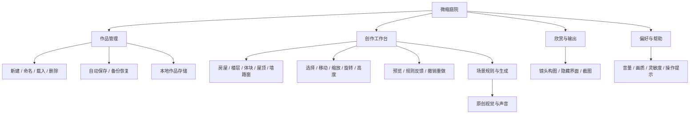
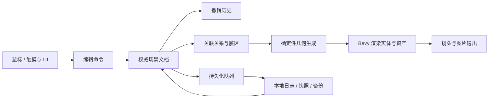

# 自由建造微缩庭院手游——产品架构

> 版本：0.8｜日期：2026-10-09｜状态：桌面编辑灰盒本地推进，手机后续移植
>
> 上游：[开发需求文档](./TinyGlade_类手游_开发需求文档.md)  
> 下游：[实现计划](./TinyGlade_类手游_实现计划.md)  
> 美术实施：[美术架构与资产制作规范](./TinyGlade_类手游_美术架构.md)  
> 建筑规则：[建筑变化与资产扩展设计](./TinyGlade_类手游_建筑变化与资产扩展设计.md)  
> 工程落地：[Bevy 模块架构与实施路线](./tiny-garden/docs/模块架构.md) · [运行入口](./tiny-garden/README.md)  
> 当前方案：Windows 桌面版优先、离线单人、一套原创石木主题；P0 为 1～4 层矩形建筑外观、自动立面和规则化退台，以及折线围墙。Android/iOS 与触摸后续移植，不取消纯核心边界。

> 本文移动端界面/平台条款保留为后续设计；先按[桌面版开发计划](./tiny-garden/docs/桌面版开发计划.md)验收鼠标闭环、存档和桌面交付，Android 真机不再阻塞首版。

## 1. 产品目标与版本边界

产品提供一个随时可以打开、编辑、欣赏和保存的小世界。玩家画简单轮廓，系统自动处理墙体、屋顶、门窗及细节，让少量操作产生完整作品。

核心体验由四个承诺组成：输入迅速得到预览；修改结构后关联结果自动适配；画面变化自然衔接且可以随时再次编辑；每次修改可以撤销，退出后作品可以继续编辑。

| 版本 | 玩家获得的能力 | 建设重点 |
|---|---|---|
| P0 | 多层外观、自动开间、退台、3 种屋顶、同主题门窗材质，建房/墙/路、编辑/撤销/保存/拍照 | 完整创作闭环、尺寸变化与手机操作体验 |
| P1 | 圆塔、更多样式、围栏、植被、水、轻地形、日夜和环境动物 | 扩展构图与表达能力 |
| P2 | 楼梯桥梁、室内、任意复杂组合、分组、宠物、在线分享等独立扩展 | 在核心稳定后逐项立项 |

P0 覆盖 FR-01～FR-16、FR-23～FR-27；多层外观和尺寸驱动变化已纳入首版。进入建筑与养宠继续按此前约定留在后续版本。首版没有体力、施工等待、资源经营或强制任务；商业模式另行决定。

## 2. 产品功能架构



| 模块 | 产品责任 | 输入与输出 | P0 验收重点 |
|---|---|---|---|
| 作品管理 | 管理多个独立作品及其名称、缩略图 | 作品选择 → 编辑会话 | 不串档；删除确认；损坏作品可恢复 |
| 创作工具 | 将手势转换为可理解的修改 | 手指轨迹 → 预览与提交 | 模式清晰；工具切换不误提交 |
| 编辑控制 | 选中对象、显示控制柄、撤销重做 | 选中 ID → 修改命令 | 目标可见；每次拖动只算一步 |
| 场景规则 | 理解建筑、墙、道路、门窗之间的关系 | 场景参数 → 派生结构 | 同一场景得到稳定结果 |
| 视觉呈现 | 呈现结构、材质、装饰、选中反馈 | 派生结构 → 画面 | 默认好看；低画质不改变作品 |
| 镜头与拍照 | 观察、构图、输出图片 | 手势与拍照请求 → 镜头/图片 | 建造手势互斥；导出有成功反馈 |
| 存储恢复 | 持久化已提交作品 | 版本化数据 → 文件与恢复结果 | 写入失败保留可用副本 |
| 音频与设置 | 提供声音反馈和可持续偏好 | 动作/偏好 → 声音与配置 | 拖动无声音堆叠；重启保留偏好 |

## 3. 界面与用户路径

### 3.1 页面结构

| 页面或浮层 | 内容 | 进入与退出规则 |
|---|---|---|
| 启动/载入 | 加载状态、必要错误提示 | 首次进入新作品；后续恢复最近作品 |
| 作品库 | 缩略图、名称、新建、重命名、删除、恢复 | 编辑界面菜单进入；切换作品前结束当前手势 |
| 创作工作台 | 场景、工具栏、撤销重做、保存状态、菜单 | 主使用页面；尽量保留最大场景视野 |
| 对象属性面板 | 尺寸、高度、朝向及工具参数 | 选中时展开；更换目标立即更新 |
| 拍照模式 | 构图、隐藏界面、拍照与返回 | 进入前取消未提交预览；离开恢复编辑工具 |
| 设置/帮助 | 音量、画质、灵敏度、手势示意 | 不清除选中与作品；关闭后回到原位置 |
| 恢复提示 | 损坏说明、有效备份、读取选项 | 读取失败时进入；保留原文件供诊断 |

首次使用路径：草地 → 房屋工具提示 → 拖出小屋 → 道路工具提示 → 画路自动成门 → 提示撤销与拍照。教学按已完成的动作推进；允许随时跳过，并在帮助中重新查看。

### 3.2 横屏工作台布局

场景居中；一侧放常用工具，另一侧显示当前对象参数；撤销重做和作品菜单固定位置。属性面板可以折叠，拍照时所有编辑控件隐藏。热区与可见图标允许不同大小，建议常用按钮以至少 48 个逻辑像素作为起始设计值，最终按真机验证。

工具选择属于用户可见状态。保存提示使用“保存中 / 已保存 / 保存失败”，只有持久化完成后才显示“已保存”。生成仍在运行时可以保存作品参数，载入后继续重建画面。

P0 的擦除入口执行选中对象的整体删除；道路局部擦除与复杂笔刷裁剪留给后续扩展。界面通过名称和预览明确删除范围，避免把整条道路删除误解为局部擦除。

### 3.3 创作与镜头手势

| 场景 | 单指 | 第二指加入 | 手势结束 |
|---|---|---|---|
| 房屋/墙线/道路工具 | 创建临时预览 | 取消当前预览，进入镜头手势 | 单指正常松开且合法时提交 |
| 选择工具 | 点击选中，拖控制柄修改 | 取消尚未提交的控制柄修改，进入镜头手势 | 合法修改提交为一步 |
| 镜头工具 | 平移镜头 | 双指缩放/旋转并平移 | 只改变镜头 |
| UI 热区 | 由 UI 消费 | 按 UI 手势处理 | 不穿透到建造工具 |
| 系统打断/失焦 | 取消预览并释放手势所有权 | 不提交修改 | 已提交数据正常保留 |

双指手势结束后必须等待所有手指离开，再接受下一次建造手势，避免剩下的一根手指意外绘制。长按仅提供快捷操作，删除、旋转等关键功能始终有可见入口。

### 3.3.1 鼠标与触摸屏输入范围（FR-24）

仅适配鼠标和触摸屏，不建设游戏手柄/控制器的轴、按钮映射、焦点导航、振动或按键提示。文档中的“控制柄”是画面内编辑操作点，与游戏手柄无关。

| 操作 | 鼠标 | 触摸屏 |
|---|---|---|
| 工具与 UI | 左键点击 | 单指点击 |
| 绘制/控制柄编辑 | 左键拖动 | 单指拖动 |
| 镜头平移 | 相机工具中左键拖动 | 双指平移；相机工具中单指平移 |
| 镜头旋转 | 右键拖动或点击镜头面板 | 双指旋转或点击镜头面板 |
| 镜头缩放 | 滚轮或点击缩放按钮 | 双指缩放或点击缩放按钮 |
| 撤销/重做、删除、拍照 | 点击可见按钮 | 点击相同按钮 |

触摸端不以悬停作为发现功能或完成操作的条件；鼠标悬停可以增强提示。所有游戏操作不依赖键盘快捷键，作品名称等文字输入使用平台系统文本输入服务。

输入层将两类输入统一转换为带设备来源的指针与手势动作；工具层消费相同编辑意图。鼠标保留按钮/滚轮信息，触摸保留触点 ID 与多指信息。混合设备每个编辑事务只有一个输入来源；切换设备先取消未提交事务、释放捕获，再开始新动作。对触摸派生的兼容鼠标事件去重，避免一笔产生两个对象。

### 3.4 产品状态

应用级状态为 `Boot → Library/Loading → Editing`，载入失败进入 `Recovery`。拍照、设置、作品库等通过覆盖层状态管理；进入作品库需暂停编辑事务，载入另一个作品则创建新会话。

编辑级状态为 `Idle → Previewing → Commit/Cancel → Idle`。工具类型、当前选中对象与手势状态分别保存，避免通过一个大型枚举表达所有组合。取消预览不占用撤销记录；撤销后再执行新命令清空重做分支。

## 4. 总体技术架构



架构围绕 `SceneDocument` 组织。文档存储玩家的对象和参数，规则层计算派生结果，Bevy 展示结果。编辑输入、存储及生成都通过定义好的接口访问文档。

| 层 | 包含内容 | 依赖限制 |
|---|---|---|
| 产品与输入层 | 页面、工具、手势、选择、提示 | 调用编辑入口；不直接改生成网格 |
| 场景领域层 | 对象、参数、命令、校验、版本 | 不依赖 Bevy、操作系统或 GPU |
| 几何层 | 相交、轮廓、开口切分、屋顶和网格数据 | 输入纯数据；输出纯数据 |
| 应用协调层 | 变更分发、生成队列、映射、保存调度 | 连接纯数据与 Bevy |
| 呈现层 | Mesh、材质、相机、UI、声音 | 展示文档及派生结果 |
| 平台层 | 私有存储、生命周期、相册/分享 | 用接口隔离 Android/iOS 差异 |

### 4.1 当前模块工程与后续结构

```text
tiny-garden/
  Cargo.toml
  Cargo.lock
  crates/
    geometry/            garden-geometry：基础矩形运算
    domain/              garden-domain：合法建筑聚合与体块规则
    application/         garden-application：编辑用例、预览、历史、任务版本
    generation/          garden-generation：纯建筑布局与 Mesh 编译
    bevy-adapter/        garden-bevy：Plugin、任务执行、ECS 投影与演示
    presentation/        garden-presentation：主题、资产检查、可选桌面呈现
  assets/                主题 JSON 与模型 planned 清单
  art-source/            美术源文件合同、灰盒脚本与实机参考截图
  scripts/               依赖边界检查
  docs/                  实际模块架构、实施路线、验证记录
```

这细化了早期 `scene-core / geometry-core / game-app / mobile-shell` 草图：纯编辑用例和建筑规则编译从 Bevy 中独立，领域只依赖不理解游戏的基础 geometry。所有依赖单向，四个纯核心都不依赖 Bevy；Bevy 适配层组装它们。当前每个 crate 都有可测试实现，不按插件数量拆 crate。

首阶段已实现建筑意图、编辑/预览/撤销、楼层/窗格/屋顶/退台布局和异步 ECS 投影；后续新增墙洞/三屋顶 Mesh、主题基础色及桌面灰盒。当前支持统一指针路由、已显示网格拾取/选择包围框、矩形建造、移动/尺寸线框预览、屋顶/高度/删除及历史按钮、镜头旋转/缩放/平移。2026-10-09 本地实现仍未完成正式控制点/上层工具、画面过渡、道路开门、存储或 Android 包装，且未完成真实窗口操作验收。后续 persistence、ui、audio 按内聚模块建设；`platforms/` 尚待实现。Blender 首批门窗/烟囱与四套烘焙纹理已接入，见[首批验收](./tiny-garden/docs/房屋资产首批验收.md)。其余正式美术按[资产制作计划](./tiny-garden/docs/美术资产制作计划.md)推进，不把占位画面算作资产验收。

## 5. 权威数据、派生数据与运行时数据

### 5.1 数据所有权

| 类别 | 示例 | 是否保存 | 所有者 |
|---|---|---|---|
| 玩家意图 | 建筑轮廓、墙线、道路、手动窗、样式 | 是 | SceneDocument |
| 场景元信息 | 稳定 ID、名称、种子、格式/规则版本 | 是 | SceneDocument |
| 派生结构 | 道路自动门、墙段切分、屋顶、装饰位置 | 可重建；P0 不保存 | 规则与生成层 |
| 渲染资产 | Mesh、材质句柄、实例缓冲 | 否 | 呈现层 |
| 编辑临时状态 | 预览、选中、撤销栈、手势 | 会话内；P0 不持久化历史 | 编辑层 |
| 用户偏好 | 音量、画质、灵敏度、教学完成标记 | 是，独立于作品 | 设置层 |
| 镜头 | 观察中心、距离、角度 | 保存最近构图；不参与几何逻辑 | 镜头层 |

Bevy 的 `Entity` 与资产 `Handle` 只在当前进程有效。作品 ID 和对象 ID 是可持久化标识；重新载入通过映射建立新的 Entity，不序列化运行时实体编号。

作品名称和最近镜头属于文档元信息更新，通过同一持久化队列保存，但不加入建筑编辑的撤销栈，也不触发几何重建。镜头连续移动在停止后合并保存，避免逐帧写盘。

### 5.2 领域模型

以下为概念结构，不代表已存在的可编译接口。核心库使用自己的简单向量类型；坐标为 XZ 地面、Y 向上，建议 1 世界单位对应 1 米，用统一 `SceneLimits` 约束。

```rust
struct SceneDocument {
    schema_version: u32,
    rules_version: u32,
    scene_id: SceneId,
    name: String,
    seed: u64,
    buildings: Vec<BuildingSpec>,
    walls: Vec<WallSpec>,
    paths: Vec<PathSpec>,
    props: Vec<PropSpec>,
    environment: EnvironmentSpec,
    camera_bookmark: CameraBookmark,
}

struct BuildingSpec {
    id: ObjectId,
    transform: BuildingTransform,
    segments: Vec<BuildingSegmentSpec>,
    style: BuildingStyle,
}

struct ManualOpeningSpec {
    id: OpeningId,
    segment: SegmentId,
    face: FaceId,
    story: StoryAnchor,
    position_ratio: f32,
    sill_height: f32,
    width: f32,
    height: f32,
    style: OpeningStyle,
}

struct PathSpec {
    id: ObjectId,
    points: Vec<Point2>,
    width: f32,
    style: PathStyle,
}
```

矩形建筑墙面采用稳定本地面 ID，旋转和缩放后窗户仍锚定同一墙面。沿墙位置使用归一化比例，宽高为实际尺寸；墙变短导致窗户无法放下时进入“暂不可显示”派生状态，保留用户参数。

建筑包含带父子承托关系的体块，层数/屋顶意图/自动窗覆盖参数保存于体块中；楼层、开间、有效屋顶及退台由规则生成。完整 `BuildingSegmentSpec` 与旧单层迁移规则见[建筑变化设计](./TinyGlade_类手游_建筑变化与资产扩展设计.md)。

道路自动门不写入 `manual_openings`，其派生标识包含建筑/体块 ID、墙面 ID、道路 ID 与稳定区间。自动窗与层间构件另含楼层/槽位 ID，手工覆盖独立保存。生成装饰使用对象和局部部件的稳定种子，改变一个对象不应重新随机化整个场景。

### 5.3 校验与确定性

所有输入需检查非有限数值、最短线段、最大点数、边界与对象数量。手势数据先简化，再转换为规范化参数。容差从配置统一读取；拓扑判断使用可控精度和稳定排序。

P0 目标是相同规则版本下加载/撤销结果稳定。跨 CPU/GPU 平台逐比特一致不是默认保证，应以规范化参数、排序、固定种子和几何样本验证；需要更强一致性时再引入量化坐标。`schema_version` 管存档结构，`rules_version` 管生成含义，二者分别迁移。

## 6. 编辑事务、关系规则与核心算法

### 6.1 编辑事务

1. 手势开始时记录目标和初始参数，创建临时预览副本。
2. 手势移动只更新副本及低成本展示，不追加历史或写盘。
3. 松手后校验候选数据；失败保留原对象并提示原因。
4. 成功时一次应用命令，增加场景/对象修订号，生成变更集合。
5. 同一变更集合进入历史、脏区和持久化队列。

命令可包括 `CreateObject`、`UpdateObject`、`DeleteObject`。撤销记录保留修改前后最少必要数据；稳定对象 ID 在撤销恢复后保持不变。自动门等派生结果不另算一步撤销。

### 6.2 P0 结构关系契约

| 情况 | 明确规则 | 恢复行为 |
|---|---|---|
| 道路横穿墙面 | 用道路宽度覆盖区间生成门洞，区间合法才接受 | 删除或移动道路后重建完整墙面 |
| 道路贴墙/擦角 | 达不到穿越阈值不生成门；预览显示当前判断 | 移到合法交点立即更新 |
| 一条道路穿过房屋两侧 | 每个合法墙面分别生成门 | 单条路径变化重算受影响面 |
| 同面多条道路 | 区间重叠时合并；分离且满足间距时独立生成 | 区间消失后拆分或恢复 |
| 门洞覆盖手动窗 | 自动门优先；窗暂隐藏，保留原参数 | 道路移走后窗重新出现 |
| 手动窗相互重叠 | 新操作拒绝并给出提示 | 原作品保持有效 |
| 房屋缩小使窗无法放下 | 暂隐藏，不擅自删除 | 尺寸恢复后再显示 |
| 独立建筑重叠 | P0 禁止实体体积相交；支持正常相邻 | 拒绝越界候选位置 |
| 同建筑上下体块 | 同朝向、上层轮廓在下层承托范围内，接触面合法 | 重新计算平台/退台，删除上层恢复屋顶意图 |
| 自动窗与手工窗 | 手工占用优先，自动开间避让 | 手工变化后局部重新布局，保留休眠覆盖 |
| 围墙节点/折角 | 固定规则连接，短段合并或拒绝 | 编辑后局部重建 |

门洞合并与间距规则使用配置中的阈值，不靠随机决定。P0 只处理矩形房屋墙面、简单折线围墙和道路笔触；不承诺任意建筑融合、曲墙或复杂自动屋顶。这些契约细化原需求 FR-08，不要求复杂实体布尔运算。

### 6.3 几何流水线

| 步骤 | 方法与产物 | 主要边界 |
|---|---|---|
| 轨迹简化 | 距离采样、折线简化，得到有限控制点 | 噪声、重复点、过长笔画 |
| 道路表面 | 折线扩宽，处理接头，生成地面网格 | 尖角、短段、自交；P0 可限制非法自交 |
| 关系候选 | 对象 AABB 与空间索引查询 | 删除后更新索引；包含旧位置和新位置 |
| 门洞区间 | 道路覆盖与墙面的相交区间，排序/合并 | 相切、近平行、跨角、多个开口 |
| 墙面生成 | 按开口边界将矩形墙面分块，生成厚度和洞内表面 | 顶点绕序、法线、UV、零面积片 |
| 屋顶生成 | 矩形参数化屋顶，屋脊、屋檐与墙高联动 | 极小轮廓、比例极端 |
| 楼层与立面 | 层数、开间、手工覆盖与层间构件 | 阈值迟滞、合法窗区间、稳定槽位身份 |
| 叠层与有效屋顶 | 承托校验、双坡/四坡/平顶、退台差集 | 无环父子树、无悬空、无重复顶面 |
| 装饰生成 | 按稳定种子放置少量细节，排除洞口和边缘 | 穿插、密度、手机成本 |
| 输出 | 结构网格、材质分组、简化拾取代理、诊断 | 预算超限、不可用材质 |

首版采用参数化切分生成墙面和洞口。真实砖块数量由美术预算决定；砖缝优先由材质或合并几何表达。窗口和门框可用少量原创模板与参数组合。

### 6.4 脏区与依赖关系

关系索引记录“道路影响哪些墙面”“墙面属于哪个对象”。改变对象时同时考虑旧包围盒和新包围盒，否则离开旧位置后会留下自动门。删除道路也通过同一关系索引触发修复。

初始实现可用有界场景的线性候选扫描。诊断证明扫描成为瓶颈时再换网格索引，保持查询接口不变。每次修改只重建相关结构；原始编辑参数的校验与提交始终同步完成。

## 7. Bevy 插件与运行时组织

Bevy 的 Plugin 用于注册资源、系统和配置；ECS 使用实体、组件和系统组织运行时逻辑。参考官方 [Plugins](https://bevy.org/learn/quick-start/getting-started/plugins/) 与 [ECS](https://bevy.org/learn/quick-start/getting-started/ecs/)。本节名称为本项目设计，具体事件/消息 API 以锁定的 Bevy 版本为准。

| 插件 | 主要资源/组件 | 责任 |
|---|---|---|
| AppFlowPlugin | AppState、OverlayState | 启动、载入、编辑、恢复与覆盖层 |
| InputPlugin | PointerSession、GestureOwner、InputSource | 鼠标/触摸适配、UI 消费、手势仲裁与重复事件抑制；不适配游戏手柄 |
| EditorPlugin | EditorSession、Selection、CommandHistory | 工具预览、校验、提交、撤销重做 |
| ScenePlugin | CurrentDocument、ObjectEntityMap | 当前文档、会话标识、变化输出 |
| GenerationPlugin | DirtySet、GenerationQueue、GenerationTask | 关系计算、任务调度、结果校验 |
| RenderStylePlugin | ThemeAssets、GeneratedPart、PickProxy | 网格/材质、选中效果、资产回收 |
| TransitionPlugin | DisplayState、TargetState、PartTransition | 当前显示参数、目标重定向、部件过渡及结束回收 |
| CameraPlugin | CameraRig、CameraBookmark | 镜头手势、构图与约束 |
| PersistencePlugin | SaveQueue、SaveStatus | 日志、快照、备份、迁移和恢复 |
| MobileUiPlugin | 面板状态、工具参数 | 作品库、工具栏、设置和提示 |
| AudioPlugin | 音频资产、音量偏好 | 音乐、环境声、节流后的动作音 |
| PlatformPlugin | PlatformServices、LifecycleState | 文件路径、系统打断、图片输出 |
| DiagnosticsPlugin | FrameStats、GenerationStats | 本地性能记录和回归工具 |

`CurrentDocument` 是资源；可编辑物体根实体带 `ObjectId` 和对象类型组件。生成子实体带 `GeneratedPart`，不复制一份可写的 BuildingSpec。选中操作通过 ObjectId 查询文档，防止文档与组件出现两个权威副本。

逻辑顺序建议为：输入采集 → 手势仲裁 → 编辑预览/命令提交 → 变更分发 → 任务调度 → 完成结果应用 → 呈现同步。用明确系统集合约束必要先后，避免依赖插件注册顺序。使用 `Commands` 延迟创建/删除实体时，按实际可见性需求安排同步点；耗时生成与文件 IO 不阻塞帧循环。

### 7.1 异步生成的正确性

每个任务携带 `scene_session_id`、对象/依赖修订号、规则版本和质量档位。输入是不可变快照。结果应用前确认任务仍匹配当前会话及所有依赖；仅检查建筑自己的修订号不够，道路变化也会使结果失效。

同一对象连续修改合并等待任务，旧结果完成后丢弃。限制并发数量，优先当前选中对象。新结果准备成功才替换旧画面；预览层独立显示，替换过程不短暂消失。错误保留旧结构并提供诊断，不能静默用过时几何冒充最新结果。

资源回收按实体映射与持有关系进行，保证共享材质不被误删。作品切换清空对应会话队列及生成实体，晚到任务因会话不匹配被拒绝。

### 7.2 连续编辑与过渡动画（FR-23）

玩家强调的“变化衔接自然”成为本产品的核心设计要求。本节描述我们拟实现的机制，不推断 Tiny Glade 的内部动画代码或实现方法。

连续性贯穿输入、预览、生成、结果交接及装饰反馈。动画层维护“当前显示参数”和“最新目标参数”，文档依然只保存已提交的目标。动画不改写领域数据，也不阻止下一次编辑。

| 变化 | P0 呈现方式 | 连续性要求 |
|---|---|---|
| 移动/拖控制柄 | 拾取锚点与操作轮廓及时跟手；主体低成本参数更新 | 不为等待动画而拉开手指与目标 |
| 宽高/屋顶变化 | 在同一参数化结构上更新或插值尺寸、屋脊与屋檐 | 墙、窗锚点和屋顶采样同一组显示参数 |
| 道路穿墙成门 | 按稳定部件拆分墙面；合法门洞与门框协调过渡 | 门位置固定，变化限于受影响墙面 |
| 门洞消失/窗恢复 | 墙面恢复与门框退出相互衔接，窗从保留参数恢复 | 不能先露出完整墙再闪回旧门 |
| 新增/删除小装饰 | 受控缩放/显隐，小幅错开时间 | 主体先可读，细节不拖延下一次输入 |
| 预览交接最终结构 | 在同一显示位置交接，高质量细节随后补齐 | 不出现预览消失而正式结果尚未显示的空帧 |
| 镜头移动/释放 | 手势期间及时跟随，结束时短暂平滑收敛 | 不反复超调，不与建造抢输入 |
| 撤销/重做/手势取消 | 立即更新逻辑目标，从当前显示状态衔接新目标 | 可以在任意时刻打断，不串行播放旧动画 |

连续参数变化采用时间步长稳定的插值或临界阻尼方式，使用每帧耗时计算更新量。连续输入只重定向目标；保持当前显示值，若使用弹簧模型则保留当前速度。避免每次移动都重新启动固定时长动画，否则会形成追赶、拖尾和跳回起点。

墙面开洞属于拓扑变化，不能直接对任意两份不同顶点数量的 Mesh 做插值。P0 为墙块、门框、屋顶和装饰建立稳定 `PartKey`，对可对应部件更新参数，对出生/退出部件分别过渡。门洞几何与框架须保持合法组合；采用遮罩或透明过渡前单独验证深度、阴影和手机成本，P0 默认优先参数化分块策略。

异步结果带结构描述与部件标识，动画协调器计算可对应部件，再将当前显示状态转向最新结果。只保留当前画面、有效目标和必要退出部件；不为每个过时目标保留一整套网格。动画结束回收退出部件，生成失败保留已有画面并给出反馈。

拾取代理与可见主体保持一致；领域合法性校验使用候选目标。再次编辑从当前显示位置建立手势锚点，明确记录显示到领域参数的映射，避免点击视觉位置却突然跳到尚未到达的逻辑位置。控制柄与关联部件共同更新，不能各自启动互不关联的动画。

起始调参范围：跟手轮廓在下一可见帧响应；主体收敛约 80～180 ms；拓扑部件过渡约 120～250 ms；细节补齐约 150～350 ms。它们是待试玩的设计区间，不是竞品测量值或强制等待时长。优先保证响应和无断层，关键变化可并行，不逐个排队。

提供减少动效选项：取消弹性、小装饰入场和非必要错峰，仍保留及时预览与无空帧交接。高低画质与动效设置只改变显示方式，不改变门洞规则、撤销结果或存档。

验收场景包括：持续往复拖动 10 秒、屋顶快速变高变低、道路反复进出墙面、自动门覆盖窗后恢复、动画中撤销/重做、第二指加入取消预览、30 FPS 与波动帧时间。检查无空帧、无旧结果回闪、无越来越长的动画队列、无相关部件明显错位，并在 M2 灰盒阶段进行首次验证。

## 8. 本地存储与平台服务

### 8.1 作品目录

```text
app-private/
  settings.json
  scene-index.json
  scenes/<scene-id>/
    snapshot.json         版本化场景快照与已包含序号
    commands.log          快照后已提交命令，带序号和校验
    thumbnail.png
    backups/              最近若干有效快照与关联恢复信息
```

原型用可读 JSON 方便排查。缓存不作为恢复必需文件，索引损坏可从作品目录重建。名称变化不改变目录 ID；P0 撤销历史仅存在于当前编辑会话，日志用于恢复持久化状态。

### 8.2 保存语义

已提交命令先进入持久化队列；日志写入并完成平台提供的持久化同步后显示“已保存”。后台周期合并为快照，用临时文件和平台验证过的替换流程发布，只有快照已可靠包含日志序号时才截断旧日志。

产品语义是“已显示保存完成的操作在异常中断后可恢复”；仍显示保存中的最新操作在强制杀进程时可能丢失。正常离开作品等待队列完成或明确提示失败；后台切换尝试完成写入，但不依赖系统永远给足时间。恢复只回放校验通过的完整日志记录，损坏尾部不破坏已有快照。

同时维护文件格式和生成规则迁移。迁移先创建有效备份；暂不支持的未来格式给出恢复/升级提示，禁止覆盖原文件。

### 8.3 平台接口

`PlatformServices` 提供私有目录、生命周期信号、图片导出、系统分享和必要的文本输入接口。新建/重命名作品的移动端键盘流程也需要真机验证。

Android 使用原生包装工程处理平台能力；图片导出成功以系统确认的输出结果为准。iOS 后续接入相同产品接口，构建与签名工作流单独验证。Bevy 官方 [移动端示例](https://github.com/bevyengine/bevy/blob/main/examples/README.md) 提供 Android/iOS 起点；项目立项时将示例链接固定到选用版本，避免长期依赖 main 的配置。

## 9. 视觉、音频与性能架构

首版先使用锁定版本的 Bevy 常规渲染能力，验证光照、材质与阴影在目标设备上的成本。图形需求通过主题配置和档位表达；自定义材质仅在已有效果不能满足明确美术需求且有真机预算时增加。

首套“暖石庭院”主题的色板、模块适配、材质、光照、UI、动效、资产清单和制作验收见[美术架构](./TinyGlade_类手游_美术架构.md)。首版采用三种屋顶、多层立面和规则化退台，按[建筑变化设计](./TinyGlade_类手游_建筑变化与资产扩展设计.md)制作与验收；旧单层概念板仅为初始观感参考。

| 要素 | 默认表达 | 降级方式 |
|---|---|---|
| 建筑主体 | 每对象少量材质分组和合并网格 | 降低局部细分 |
| 砖、瓦、木纹 | 材质细节与有限几何边缘 | 减少装饰、纹理档位 |
| 草与小物 | 成组/实例化，距离控制密度 | 降低密度和远处显示 |
| 阴影 | 一套主要环境光与受控阴影 | 分辨率/距离/开关 |
| 预览 | 简化网格或轮廓，选中对象优先 | 控制刷新频率 |
| 声音 | 环境层、音乐层、动作层 | 独立音量、并发上限、触发冷却 |

基准场景建议从“24 座小屋、48 条围墙、16 条道路、96 个手动窗、少量装饰”起步，作为工程测试内容而非正式作品上限。先测出成本，再确定面向玩家的场景限制。

原需求 30 FPS 与局部重建 p95 < 50 ms 保持为初始目标。重建指标指提交后几何结果可应用的墙钟时间；帧循环内结果应用另设起始目标 p95 ≤ 4 ms，通过分批处理避免 50 ms 的重建直接占据单帧。大场景最终目标应由 M1/M4 真机测量修订。

性能报告记录设备、系统、构建模式、场景、画质、运行时长与采样数。跟踪帧时间、生成队列长度、过时结果数、资产占用和保存耗时，避免只报告平均 FPS。

## 10. 扩展边界与架构决策

| 决策 | 采用方案 | 原因与后续扩展 |
|---|---|---|
| ADR-01 | SceneDocument 为权威数据 | 存档、撤销、规则生成共享同一事实来源 |
| ADR-02 | 纯 Rust 场景与几何核心 | 单元测试无需启动 GPU；平台层可替换 |
| ADR-03 | 参数化墙面切分 | 适合 P0 规则结构，边界更容易验证 |
| ADR-04 | 原生 Bevy 呈现与少量插件 | 先验证手机成本，再决定自定义渲染需求 |
| ADR-05 | 本地快照与命令日志 | 支持明确的保存状态和异常恢复 |
| ADR-06 | 自动门派生、手动窗保留 | 道路修改可恢复用户原意 |
| ADR-07 修订 | Windows 桌面闭环优先，移动切片后移 | 先稳定创作/动画/保存；保留纯核心与平台边界，手机风险在移植立项时验证 |
| ADR-08 | 档位只影响呈现 | 不因设备不同改掉作品逻辑 |
| ADR-09 | 显示状态与目标分离，过渡可重定向 | 保持连续操作手感，动画中再次编辑不等待 |
| ADR-10 | 输入范围只包含鼠标与触摸屏 | 两种设备共享编辑意图与可见 UI；取消游戏手柄适配和验收 |
| ADR-11 | 首版包含多层外观和规则化退台 | 体块、开间与屋顶共同适配尺寸，室内系统保持独立 |

地形扩展需要在世界采样接口上增加高度，不直接修改每个工具。动物和养宠通过稳定对象/区域语义建立关联；室内需要新的房间拓扑与观察方式；云同步需要明确作品版本与冲突策略。这些扩展各自提交新的设计决策，P0 只保持接口清楚。

## 11. 架构验收与交付

架构落地需验证：同样命令序列可重放得到相同规范化文档；删除道路恢复墙与窗；撤销恢复相同对象 ID；切换作品拒绝旧异步结果；连续修改不会重复生成全世界；异常写入可以从有效快照与日志恢复；高低画质切换不修改文档；动画中编辑、撤销与取消可以从当前画面连续接续。

实现时同步维护领域数据说明、命令列表、几何回归样本、平台构建步骤及 ADR。当前文档定义接口和产品规则，源码开工后由实际类型与测量结果更新。
