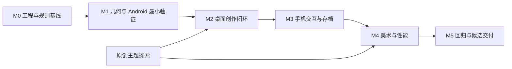

# 自由建造微缩庭院手游——实现计划

> 版本：0.7｜日期：2026-10-08｜状态：桌面优先，原 Android 排期转为后续参考  
> 输入：[开发需求文档](./TinyGlade_类手游_开发需求文档.md)、[产品架构](./TinyGlade_类手游_产品架构.md)  
> 美术任务规范：[美术架构与资产制作规范](./TinyGlade_类手游_美术架构.md)  
> 建筑任务规范：[建筑变化与资产扩展设计](./TinyGlade_类手游_建筑变化与资产扩展设计.md)  
> 当前工程：[运行入口](./tiny-garden/README.md)、[模块设计与 A1–A6 实施路线](./tiny-garden/docs/模块架构.md)、[验证记录](./tiny-garden/docs/验证记录.md)  
> 当前范围：FR-01～FR-16、FR-23～FR-27 的 Windows 桌面创作版；鼠标优先，触摸与手机后移；P1/P2 另排后续里程碑。

> **当前执行计划：[桌面版开发计划 D0–D6](./tiny-garden/docs/桌面版开发计划.md)。** 下文 M0–M5、T09/T10 等移动任务与 Android 工期是保留的原方案，不作为当前桌面排期/验收。共用任务 ID 可复用，但依赖和完成门以 D0–D6 为准；不能把后移任务误标为已完成。

## 1. 实施目标与计划假设

先完成 Windows 桌面离线创作版本：建筑宽高变化能生成开间和 1～4 层立面，可组合规则化退台、切换三种屋顶和同主题材质，且鼠标建房/道路成门/编辑/撤销/保存/拍照闭环成立。Android 与触摸不是首阶段交付门。

已建立独立工程 `tiny-garden/`，完成建筑聚合、编辑预览/历史、纯布局生成与 Bevy 异步 ECS 投影；新增基础墙洞/三屋顶 Mesh、主题色板、六建筑桌面比例场及四个测试按钮。美术按[制作计划](./tiny-garden/docs/美术资产制作计划.md)的 B0–B5 推进，26 个关键模型已有 planned 清单，尚无生产批准资产。当前未完成自由建造输入、正式工具 UI、画面过渡、道路开门、存档或 Android 打包，不能认定任何完整产品里程碑通过。详细覆盖见工程模块设计与验证记录；本计划的完整 P0 工期不因底层用例通过而直接扣减。

输入适配和验收仅覆盖鼠标、触摸屏，不安排游戏手柄/控制器任务。鼠标在桌面参考环境验证，触摸在 Android 真机验证，混合输入在具备条件的设备验证；手机外接鼠标作为适用设备上的补充检查。屏幕编辑控制柄仍属于必需功能。本计划此前没有单独计入手柄人日，本次不虚减工期，FR-24 细化现有输入/UI 工作。

基准人员配置：2 名全职程序（A：领域/几何/生成；B：Bevy/输入/UI/平台）、1 名美术，产品设计与测试按阶段参与。工期从正式开工计算，默认 5 个工作日/周；人员经验、可用设备及资产准备会改变估算。

### 1.1 排期估算

| 工作项 | 初始估算 | 说明 |
|---|---|---|
| 程序工作 | 154～232 人日 | M0～M5 汇总；本次建筑变化新增 35～55，不含 P1/P2 |
| 原创美术与 UI 资产 | 70～105 人日 | 本次增加 25～40；模块、样式、布局规则与引擎验证 |
| 产品设计/可用性测试/QA | 28～45 人日 | 试玩、B01～B12、恢复、设备与回归 |
| 双程序基准日历 | 18～25 周实施 + 2～4 周风险缓冲 | 依赖串行与整合影响；总参考 20～29 周 |
| 单程序方案 | 约 34～50 周实施，再留缓冲 | 假设仍有美术配合；平台和几何难并行 |

这些是计划估算，不是交付承诺。完成 M0/M1 后，用真实任务速度和设备数据重估剩余工作。正式发布若包含付费、广告、账户、云服务或 iOS，需新增范围与排期。

## 2. 里程碑与依赖

| 里程碑 | 基准时间窗口 | 程序人日 | 可演示交付物 | 退出条件 |
|---|---|---|---|---|
| M0 | 第 1 周 | 6～10 | 工程、依赖锁定、规则契约、基准设备记录 | 核心测试和桌面启动可复现 |
| M1 | 第 2～5 周 | 21～31 | 几何、分层模型、Android 灰盒 | 真机平台可用，体块/层数规则与墙洞正确 |
| M2 | 第 6～11 周 | 44～65 | 多层/开间/屋顶/退台与编辑闭环 | 尺寸产生丰富变化，结果交接连续；每周 Android 包 |
| M3 | 第 12～15 周 | 30～44 | 手机编辑、作品库、存档与导出 | 楼层/体块控件可用，变化与恢复通过 |
| M4 | 第 16～20 周 | 30～47 | 扩展资产、布局/动画调优与性能 | 多层真机成本达标、部件变化稳定 |
| M5 | 第 21～25 周 | 23～35 | 变化用例回归与候选交付 | P0 与 B01～B12 全通过 |

窗口是工作安排参考，不是所有估算同时取下限的结果。M2 起每周提供 Android 构建，避免到 M3 才第一次把完整工具跑上手机。M1 两条工作线并行：A 验证几何，B 验证平台。

## 3. 任务拆解与验收

任务状态使用“未开始 / 进行中 / 待验收 / 已完成 / 受阻”。下列负责人为角色，不是已分配的真实人员；程序估算按里程碑管理，避免同时把阶段和每个任务重复计入总人日。

### M0：工程与设计基线

| ID | 任务 | 负责人 | 依赖 | 交付物与验收 |
|---|---|---|---|---|
| T00 | 创建独立工程与 Cargo workspace | A/B | 无 | scene-core、geometry-core、game-app、mobile-shell；不引用无关游戏代码 |
| T01 | 锁定 Rust/Bevy/NDK/构建配置 | B | T00 | 工具链记录、Cargo.lock、可复现步骤；用锁定版本示例验证配置 |
| T02 | 确定对象、坐标、开口及范围规则 | A/产品 | 无 | 类型草案、SceneLimits、冲突表；对应架构第 5～6 节 |
| T03 | 选择基准机与回归场景 | B/QA | 无 | 至少一台基准 Android、一台不同 GPU 系列设备及设备记录 |
| T04 | 建立构建与质量检查 | A/B | T00/T01 | fmt、核心测试、应用检查；Android 构建按选定原生工程执行 |
| T05 | 原创风格与模块化资产探索 | 美术/产品 | 无 | 按美术架构 A01 制作小屋概念、色板、门窗比例、UI 草图和预算，概念板转为可实施规范 |

M0 关口：团队能从干净环境按文档启动灰盒，知道首版哪些输入合法，知道如何运行几何测试。锁定版本后将参考中的 main 链接替换为对应 tag 的实施链接。

### M1：几何实验与 Android 最小验证

| ID | 任务 | 负责人 | 依赖 | 交付物与验收 |
|---|---|---|---|---|
| T06 | 规范化坐标、线段/矩形相交与容差 | A | T02 | 覆盖相切、近平行、短段、角点与非有限数值样本 |
| T07 | 矩形房屋墙、地板及屋顶生成 | A | T06 | 顶点/索引/法线/UV 正确，无零面积片和极小尺寸崩溃 |
| T08 | 道路扩宽、门洞区间及墙面切分 | A | T06/T07 | 中央穿越、两面穿越、多个开口、删除恢复的纯数据测试 |
| T09 | Android 原生包装与灰盒场景 | B | T01/T03 | 安装真机，显示相机/光照/网格，记录设备与图形后端 |
| T10 | 平台能力探针 | B | T09 | 触控、音频、私有文件、后台恢复、文本输入与图片导出可行性记录 |
| T11 | 灰盒成本测量 | A/B | T07～T10 | Release 构建性能记录；发现瓶颈时明确调整方向 |
| T44 | 体块、层数、样式覆盖与迁移模型 | A | T02/T06 | BuildingSegmentSpec、无环承托树、Auto/Locked、旧作品保持原外观 |

M1 关口：Android 最小包可反复启动和恢复；几何关系样本全部通过。若图形或平台能力无法满足目标设备，先解决配置/版本/方案，再投入大规模素材。

### M2：创作闭环

| ID | 任务 | 负责人 | 依赖 | 交付物与验收 |
|---|---|---|---|---|
| T12 | 场景文档、稳定 ID 与校验 | A | T02/T44 | 体块/对象合法性、数量边界、规范化文档往返测试 |
| T13 | 编辑命令、事务与撤销重做 | A | T12 | 创建/修改/删除；30 步回放；新编辑清空重做分支 |
| T14 | Bevy 文档到实体映射与生成调度 | A/B | T07/T08/T12 | 对象根实体、子网格、拾取代理；任务版本防护 |
| T15 | 房屋与墙线工具 | B | T13/T14 | 连续预览、松手提交、控制点编辑、非法操作反馈 |
| T16 | 道路绘制与自动门 | A/B | T08/T15 | 道路移动/删除修复墙面；前后关系变化正确 |
| T17 | 选中、移动、缩放、旋转、高度与加窗 | B | T13～T16 | 稳定墙面锚点；道路遮窗保留参数；缩小/恢复可重现 |
| T18 | 鼠标参考工作台与基础镜头 | B | T15/T17 | 左键建造/编辑、右键旋转、滚轮缩放、相机工具平移；全部操作有可点击入口；每周 Android 同步冒烟 |
| T19 | 可演示主题样本与首次试玩 | 美术/产品/QA | T05/T18 | 5 名外部或非实现者测试者尝试 1 分钟建屋，记录问题 |
| T41 | 显示/目标状态与基础过渡协调 | A/B | T14/T15/T17/T45/T46/T47 | 稳定楼层/槽位/屋顶身份、无空帧交接；连续输入重定向目标 |
| T45 | 自动分层、开间和手工开口优先 | A/B | T44/T14/T17 | B01～B05；层间构件/自动窗增减、阈值迟滞、覆盖休眠恢复 |
| T46 | 双坡、四坡、平顶三种屋顶 | A | T07/T14/T44 | B06；屋顶意图、实际尺寸 UV、转角与边沿合法 |
| T47 | 上层体块、承托平台与退台 | A/B | T44/T45/T46/T13 | B07～B09；同朝向、有效支撑、删除子树确认、一次撤销 |

M2 关口：创作闭环成立，灰盒验证楼层、开间、三种屋顶和退台，T41 的连续性通过。单层灰盒只作为早期验证，不作为本阶段最终交付。

### M3：手机交互与持久化

| ID | 任务 | 负责人 | 依赖 | 交付物与验收 |
|---|---|---|---|---|
| T20 | 鼠标/触摸统一输入与手势所有权 | B | T10/T18 | 按钮/触点生命周期、UI 消费、单/双指仲裁、打断取消、兼容事件去重；双指后剩余单指不误画；无游戏手柄适配 |
| T21 | 触屏控制柄与移动端工作台 | B/美术 | T17/T20/T45/T47 | 热区、安全区域、楼层/体块选择、屋顶/立面控件，真机可操作 |
| T22 | 双指镜头与拍照观察 | B | T20 | 平移/缩放/旋转稳定；镜头与编辑互斥 |
| T23 | 作品快照、日志、备份与迁移 | A | T12/T13/T10 | 保存状态正确，损坏日志尾部恢复，原文件受保护 |
| T24 | 作品库、新建/命名/载入/删除 | B | T23/T21 | 多作品不串档；键盘命名可用；切换拒绝旧任务结果 |
| T25 | 隐藏 UI、截图与系统输出 | B | T10/T22 | 真机输出图片可查看，失败提示明确 |
| T26 | 生命周期与存储故障测试 | A/B/QA | T20/T23～T25 | 后台、杀进程、低空间、写失败、恢复清单 |
| T27 | 手机第二轮试玩 | 产品/QA | T21～T26 | 核心任务完成率与误触记录；问题分级并回归 |
| T42 | 动画中的手机编辑、取消与撤销 | B | T20/T21/T41 | 从当前显示位置重新操作；双指取消/快速撤销不跳回旧起点、不等待动画 |

M3 关口：不用电脑即可完成作品、保存、重启继续编辑和导出图片，且 T42 的动画中再次编辑/手势打断验证通过。已显示“已保存”的状态必须在异常中断后恢复；保存队列未完成时界面不可误报成功。

### M4：原创美术、声音与性能

| ID | 任务 | 负责人 | 依赖 | 交付物与验收 |
|---|---|---|---|---|
| T28 | 完成 P0 原创主题与 UI 素材 | 美术/B | T05/T19/T21 | 按 A02～A15、A17～A24 交付扩展模型/材质、层间/退台、布局规范、22 图标与控件；源文件和授权齐全 |
| T29 | 稳定细节生成与材质整合 | A/B/美术 | T14/T28 | 改一个对象不随机化全场景；开口处无装饰穿插 |
| T30 | 脏区、合并任务与网格应用优化 | A | T14/T16/T11 | 移动仅重建相关对象，旧任务被拒绝，队列可控 |
| T31 | 网格/材质回收与画质档位 | B | T28/T30 | 切换作品与反复撤销无持续增长；档位不改作品参数 |
| T32 | 音乐、环境声、动作音与设置 | B/美术 | T10/T21 | 音量/画质/灵敏度持久化，动作音并发可控 |
| T33 | 教学与操作提示 | 产品/B | T27 | 按动作推进、可跳过/重看，避免遮挡关键目标 |
| T34 | 性能/热稳定报告与第三轮试玩 | A/B/QA | T29～T33/T43/T48 | 含四层和退台的基准场景、30 FPS 目标、p95/热报告与连续变化录像 |
| T43 | 拓扑过渡、细节节奏与波动帧率调优 | A/B/美术 | T29/T30/T42 | 按美术架构 A16 验证门洞/门框/窗恢复衔接，减少动效设置；退出部件回收；30 FPS 下无动画积压 |
| T48 | 扩展资产布局、阈值与多层预算调优 | A/B/美术 | T28/T29/T43/T47 | B10～B12；六个不同轮廓作品、固定种子、多层档位/回收与真实操作录像 |

M4 关口：目标设备达到共同认可的预算；作品在极小/极大比例和低画质下仍可读。p95 不合格时按报告定位并修复，不用平均 FPS 掩盖交互停顿。

### M5：验收、回归与候选交付

| ID | 任务 | 负责人 | 依赖 | 交付物与验收 |
|---|---|---|---|---|
| T35 | FR-01～FR-16、FR-23～FR-27 逐项验收 | 产品/QA/A/B | M4 | 多层/开间/屋顶/退台、鼠标/触摸分别走通，记录版本/设备/证据 |
| T36 | 存档升级与故障注入回归 | A/QA | T23/T35 | 旧格式迁移、坏文件、日志截断、切换作品中断恢复 |
| T37 | 设备与长时间测试 | B/QA | T34/T35 | 不同 GPU、屏幕比例、后台恢复和冷启动矩阵 |
| T38 | 修复阻断问题与最终回归 | A/B | T35～T37/T49 | 所有阻断缺陷关闭，修复影响范围重测 |
| T39 | 候选包、构建说明和素材清单 | B/美术 | T38 | 内测包；选定渠道后补签名/渠道要求并形成候选发布包 |
| T40 | 发布前范围与 DoD 审查 | 产品/QA | T39 | 通过所有完成条件；留下可接受缺陷及版本说明 |
| T49 | 建筑变化矩阵与旧作品迁移验收 | A/B/QA | T35/T36/T37 | B01～B12、多层承托/覆盖/撤销、旧单层作品不意外改变 |

M5 交付包括源码、锁定依赖、构建步骤、可安装测试包、测试报告、样例作品与素材清单。商店提交、商业合同和收费方案执行以另行确定的渠道范围为准；该计划不把文件交付等同于已经上架。

## 4. 需求与任务追踪

| 原需求 | 覆盖任务 | 必要证据 |
|---|---|---|
| FR-01 作品管理 | T23/T24/T36 | 多作品命名/读取/删除和恢复记录 |
| FR-02 草地与边界 | T02/T12/T15/T28 | 越界、极小尺寸、对象上限样本 |
| FR-03 建房 | T07/T15/T20/T21 | 真机连续预览到提交录像 |
| FR-04 基础编辑 | T13/T17/T21 | 控制柄操作与撤销后状态 |
| FR-05 自动结构 | T07/T14/T29 | 尺寸/高度变化及重载对照 |
| FR-06 墙线 | T06/T15/T30 | 折角、短段、端点编辑 |
| FR-07 道路 | T08/T16/T20 | 笔触简化、宽度、非法自交反馈 |
| FR-08 自动门 | T08/T16/T17/T30 | 交点、遮窗、删路还原和撤销 |
| FR-09 窗户 | T12/T17/T29 | 墙面锚点、冲突、尺寸恢复 |
| FR-10 选择反馈 | T14/T17/T21 | 选中/遮挡/控制柄热区录像 |
| FR-11 撤销重做 | T13/T35 | 30 步、分支清空、文档对照 |
| FR-12 触屏镜头 | T20/T22/T27 | 第二指加入/退出/系统打断 |
| FR-13 自动保存 | T23/T26/T36 | 已保存状态、故障恢复证据 |
| FR-14 拍照 | T22/T25/T35 | 手机输出图片与失败路径 |
| FR-15 设置 | T31/T32/T35 | 重启保留；不影响作品几何 |
| FR-16 音频 | T10/T32/T35 | 音量、连续拖动、后台恢复 |
| FR-23 连续编辑与过渡 | T41/T42/T43/T35 | 往复拖动、拓扑变化、动画中打断、低帧率与无空帧交接录像 |
| FR-24 鼠标与触摸完整操控 | T18/T20/T21/T22/T35 | 两种输入独立完成全流程，无悬停依赖、无重复提交；输入切换和按钮/触点打断记录 |
| FR-25 多层外观与退台 | T44/T45/T47/T48/T49 | 1～4 层、父子高度/删除恢复、有效承托与存档 |
| FR-26 尺寸驱动立面 | T45/T41/T48/T49 | 宽度/开间对应、手工优先、阈值往返、覆盖恢复 |
| FR-27 屋顶与资产组合 | T46/T28/T29/T48/T49 | 三屋顶/三立面/门窗变体；六种不同轮廓作品 |

## 5. 关键技术实验

| 实验 | 最晚完成 | 需要回答的问题 | 不通过时的处理 |
|---|---|---|---|
| Android 最小应用 | M1 | 显示、触控、文件、音频是否可复现 | 修正版本/配置和平台桥接；重估设备范围 |
| 参数化门洞 | M1 | 相切/角点/多开口能否稳定处理 | 收紧合法输入并明确提示；保留核心横穿成门 |
| 分层/开间与退台 | M1～M2 | 尺寸是否产生明显变化，父子布局和手工覆盖是否稳定 | 固定槽位、迟滞、支撑校验与简单矩形差集；复杂融合留后续 |
| 手机控制柄 | M3 初期 | 手指遮挡和双指切换是否可用 | 扩大热区、增加面板微调、修改镜头模式 |
| 局部生成与任务失效 | M2/M4 | 连续编辑是否闪烁、回退或排队 | 合并任务、版本校验、分批应用 |
| 可打断连续变化 | M2，M3/M4 回归 | 动画中继续拖动/撤销是否从当前显示状态接续 | 目标重定向、稳定部件映射、统一显示参数；避免动画串行积压 |
| 保存恢复 | M3 | 文件写到一半中断是否保留有效状态 | 改日志/快照发布流程；不能靠提示跳过可靠性 |
| 主题与性能 | M1/M4 | 装饰、阴影与草的成本是否可接受 | 降装饰密度/阴影，调整纹理与合并方式 |

每个实验形成一页记录：问题、选项、样本、结果、决策、设备与构建版本。新结论更新架构 ADR 和剩余排期。

## 6. 测试与验收策略

### 6.1 核心自动验证

纯核心测试覆盖几何边界、对象校验、命令回放、存档迁移及恢复。网格检查验证索引范围、非有限顶点、零面积片、法线与包围盒；关键样本另做画面对照。文档比较先规范化对象排序和数值表示，不依赖截图判断撤销是否正确。

命令测试至少包括：创建→修改→删除→撤销恢复、删路恢复墙窗、缩房隐藏窗→放大恢复、撤销后新建清空重做。任务测试包含：道路已变但建筑版本未变、切换作品后旧结果到达、对象删除后任务完成。

存储测试在快照写入、替换、日志追加和截断的不同位置模拟中断，确认恢复逻辑不产生重复命令或覆盖有效作品。

### 6.2 真机回归

覆盖冷启动、后台往返、触控打断、第二指加入、画面安全区、软键盘命名、图片输出失败、低空间、音频恢复与热降频。每个正式里程碑报告使用 Release 构建，保留必要诊断符号；Debug 数据仅用于定位问题。

鼠标回归覆盖点击、拖动、右键旋转、滚轮缩放、UI 热区、窗口失焦和按钮释放；触摸回归验证全部功能不依赖鼠标悬停。混合输入检查触摸后的兼容鼠标事件和设备切换，确认无重复命令或残留预览。不安排游戏手柄映射、导航或兼容性测试。

### 6.3 首版完成条件

1. FR-01～FR-16、FR-23～FR-27 均有通过记录；无阻断或严重数据丢失缺陷。
2. 新用户可按短提示在 1 分钟内建出屋顶、墙和自动门的小屋；未达成则记录并修正交互。
3. 道路成门及移走还原稳定；门窗冲突符合架构契约。
4. 撤销、重做、载入保持作品语义一致；已保存操作可在异常中断后恢复。
5. 基准场景在目标 Android 达到至少 30 FPS 的初始目标；热测试、局部重建和主线程应用指标有报告。
6. 手机可以管理作品和导出图片；所有原创或授权资产有记录。
7. 源码、依赖锁定、构建/安装说明和版本化样例存档齐全。
8. 连续往复拖动、门窗变化、动画中撤销/重做和双指打断通过录像与真机验收；无空帧、旧结果回闪、部件明显脱节或动画积压。
9. B01～B12、24 个美术资产组和至少六个明显不同轮廓作品通过；加宽、拉高与叠层有立面/结构变化，旧作品迁移保持原意。

## 7. 风险、资源与范围控制

| 风险 | 早期信号 | 应对 | 责任角色 |
|---|---|---|---|
| 几何边界拖慢进度 | 角点/短段反复修复 | 固定合法输入、积累样本、优先稳定矩形流程 | A |
| 手机触控难用 | 误提交、点不到柄、镜头抢手势 | M1 平台验证、M3 小批量试玩与可见微调入口 | B/产品 |
| 美术生成不协调 | 参数变化造成瓦/窗比例突变 | 先定模块规范和极端尺寸样本 | 美术/A |
| 图形与散热超预算 | 帧 p95 波动、十分钟后降频 | 分档、合并网格、减少阴影/植被、连续真机测量 | B |
| 异步状态错乱 | 旧门洞覆盖新结果或串作品 | 校验会话和全部依赖修订，限制队列 | A/B |
| 动画追赶或断层 | 手指已停而建筑还长时间追赶，或开洞时闪跳 | M2 验证状态重定向；参数与拓扑分别处理，M4 调优 | A/B/美术 |
| 存档不可靠 | 保存成功后读不到最新状态 | 区分提交与持久化完成，故障注入 | A |
| 不断扩大首版 | 开始做圆塔/宠物却未通保存 | 新功能标为 P1/P2，先过当前关口 | 产品 |
| 工期波动 | 初期任务实际超过估算 | M1 后重估；用范围、资源和日历共同调整 | 全体 |

若需要缩小 P0 工作量，优先减少装饰种类、默认模板和视觉效果；简化属性呈现也可降低 UI 成本。道路自动门、基础编辑、撤销、可靠保存和手机手势是核心闭环，不能在保持同一产品目标的前提下直接去掉。

## 8. 协作、构建与进度记录

当前每周至少一次可运行 Windows 构建和一次核心流程演示；Android 周包在移植阶段恢复。任务完成需同时满足实现、相应检查与验收记录，不能仅按“代码已写”标完成。产品、美术与程序通过实际样例讨论比例、反馈和性能。

任务卡包含：ID、对应 FR、负责人、依赖、输入/输出、完成条件、估算/实际耗时、验证记录与受阻原因。代码审查重点看数据所有权、可撤销性、任务失效、存档兼容和生成边界；样式修改不重复跑所有压力测试，核心规则或存储改动则运行相关回归。

测试报告记录版本/提交、设备、构建模式、场景与结果。性能基准与回归样例入库，发布构建可追溯到源码和资源版本。具体使用哪种项目协作工具由团队环境决定，这份计划中的 ID 可以直接迁入任务看板。

## 9. 开工顺序与后续版本

当前先按桌面 D1→D2 推进镜头/拾取和自由建造，再做连续动画、场景关系和本地作品。原 T09～T10 Android 探针及真机包在移动移植阶段启动；工程/几何基础已经建立，不能重复把这些工作列为刚开工。

| 后续批次 | 建议内容 | 必须先满足的条件 |
|---|---|---|
| P1-A | 圆塔、屋顶/材质变体、围栏与更多装饰 | P0 稳定；圆形墙面和开口规则单独验证 |
| P1-B | 轻地形、水、植被笔刷 | 世界高度采样与道路/建筑适配成立 |
| P1-C | 日夜、环境动物、模板 | 性能余量明确；动物行为不影响编辑 |
| P2 独立立项 | 楼梯桥梁、可进入室内、任意复杂体块融合、养宠、社区等 | 首版规则化多层已实现；新能力分别完成设计 |

新增版本按用户试玩反馈和测量排序。当前可直接执行的范围是 Windows 桌面版；触摸/Android 在桌面闭环之后单独启动移植。人员、基准机、渠道或首发内容改变时更新文档版本与里程碑，不把后续批次自动并入现有排期。
