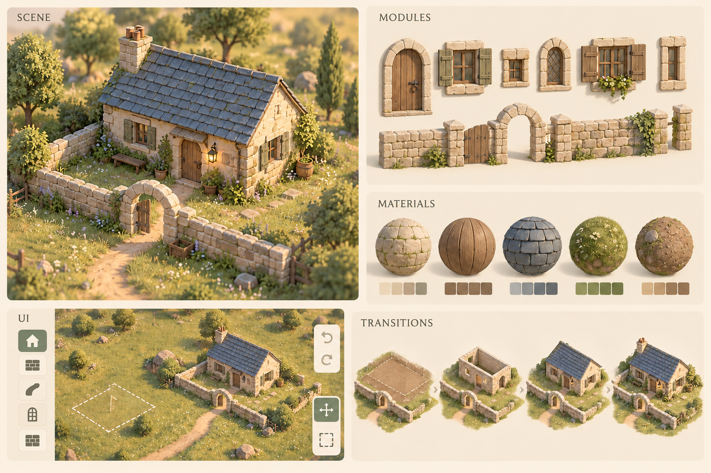
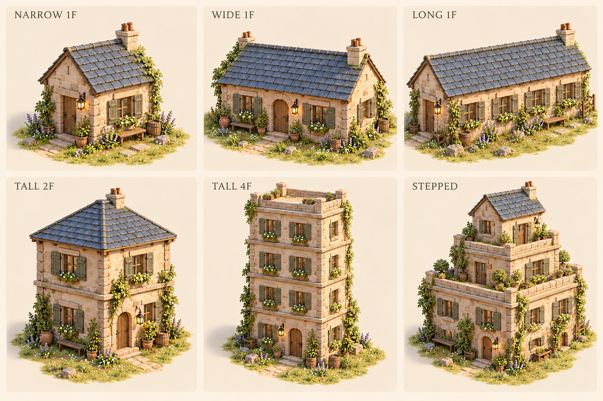
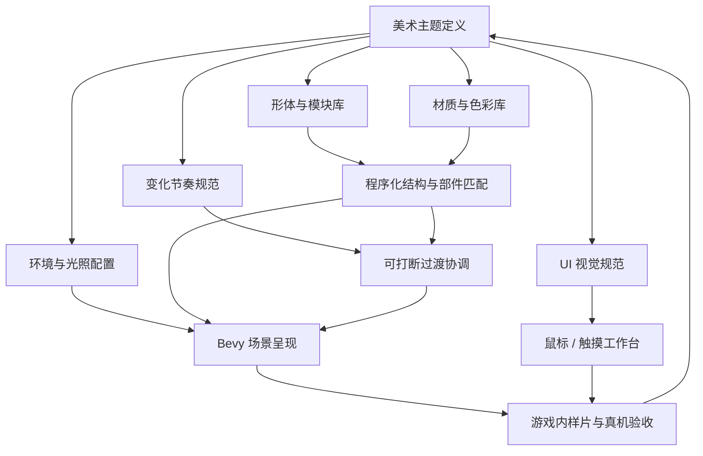

# 自由建造微缩庭院手游——美术架构与资产制作规范

> 版本：0.3｜日期：2026-10-08｜状态：制作基线、执行批次与程序比例场已建立  
> 视觉参考：Tiny Glade 的温暖微缩建筑、柔和自然环境与连续变化体验  
> 对齐文档：[需求](./TinyGlade_类手游_开发需求文档.md)、[产品架构](./TinyGlade_类手游_产品架构.md)、[实现计划](./TinyGlade_类手游_实现计划.md)  
> 平台与输入：Windows 桌面优先、鼠标；触摸/Android 后续移植  
> P0 范围：1～4 层矩形建筑外观、自动开间、规则化退台、3 种屋顶、3 个立面族、6 种窗、3 种门框与同主题装饰；进入建筑、养宠及可编辑植被等沿用原版本分期。
> 尺寸变化规则：[建筑变化与资产扩展设计](./TinyGlade_类手游_建筑变化与资产扩展设计.md)

> 当前执行：[桌面版开发计划](./tiny-garden/docs/桌面版开发计划.md)。首轮样片在桌面引擎验收；下文手机预算与触摸 UI 规则保留为移植合同，不是首轮小屋样片的阻塞条件。

## 1. 美术目标与参考边界

目标是一块可自由修改的微缩石木庭院。建筑有明确轮廓，石头与木材柔和而有触感，环境为作品提供安静的衬托。玩家调整时，结构和细节连续适配，成为世界可信度的一部分。

Tiny Glade 官方资料强调自由绘制与自动补齐关系；开发者技术说明也表明其使用 Bevy 的 ECS、调度等能力，并有自研渲染技术。参考其观感时，本项目按手机预算设计表达方式。[官方商店页](https://store.steampowered.com/app/2198150/Tiny_Glade/)、[开发者技术说明](https://pouncelight.games/tiny-glade/info/)

以下色值、比例、资产数量、预算和实现规则均是我们的设计起点，需通过游戏内样片和真机测量调整。建筑、图标、材质及装饰由本项目重新设计；文档不把视觉参考当作原游戏内部实现说明。

### 1.1 视觉基准概念板



概念板用内置 imagegen 生成，展示场景、模块、材质、UI 和变化节奏。它用于讨论观感，不是引擎实机画面，也不是可直接导入的模型/纹理集。细节密度与背景虚化属于视觉上限参考。

此图为旧单层方向样片。新首版增加多层、退台、三种屋顶、更多门窗与烟囱，以新资产清单和建筑变化设计为准；拱形开口和可编辑丰富植物仍按后续版本实施。图中四阶段变化表示整体衔接关系，不规定玩家必须等四段动画依次播放。

### 1.2 建筑变化方向图



新图并排展示同主题的窄屋、宽屋、长屋、两层、四层与退台形态。它明确变化目标，但不是已实现的游戏效果；实际层数、开间数和承托以 B01～B12 验收。完整提示词与退台面板的示意差异见[生成记录](./TinyGlade_美术架构资产/建筑变化_生成记录.md)。

## 2. 美术系统架构



美术交付“可组合素材 + 视觉参数 + 使用规则”，程序交付“形状生成 + 部件关联 + 渲染和动画”。程序化建筑也需要美术定义比例、边沿、表面尺度和极端尺寸处理方式。

| 子系统 | 美术负责 | 程序负责 | 可评审成果 |
|---|---|---|---|
| 建筑形体 | 楼层、退台、开间、比例与轮廓 | 参数化体块、立面、三种屋顶、洞口与法线 | 大/中/小、多层与退台对照 |
| 模块库 | 门窗、边框、墙帽与装饰模块 | 锚点、重复、适配、限制与选择 | 爆炸图、模块测试场 |
| 材质 | 纹理、颜色、粗糙度、接缝规则 | UV、参数、光照与质量档位 | 固定光照材质球 |
| 环境 | 草地/路径风格、背景构图 | 地面表面、道路生成与密度控制 | 无建筑/有建筑对照 |
| 光照 | 主光方向、冷暖关系与阴影观感 | 实际灯光、阴影、色调与性能 | 三个观察角度样片 |
| UI | 图标、控件外观、尺寸与状态 | 自适应布局、交互、文本与输入 | 鼠标/触摸完整流程 |
| 动效 | 节奏、幅度、关联先后 | 当前状态、目标重定向和部件回收 | 连续操作录像 |

## 3. 首套主题与视觉语言

主题工作名为“暖石庭院”，只用于内部资产分类。主要材料是浅色石灰岩、风化木与灰蓝屋瓦，草地低饱和，门窗采用厚实而克制的框架。构图由建筑主导，细节集中在门窗、屋檐和地面接触处。

### 3.1 形体层级

| 层级 | 表达目标 | 制作要求 |
|---|---|---|
| 大形 | 远看识别小屋、墙和道路 | 主轮廓稳定，屋顶与墙体层级明显 |
| 中形 | 中距离识别石块、窗框与屋檐 | 有体积的边沿、少量不规则，比例统一 |
| 小形 | 近看有材质触感 | 克制的砖缝、木纹和瓦片差异，不铺满高频噪声 |

建筑主要轴线保持规整。轻微不规则限制在单个石块、瓦边、木板边沿和色差；窗锚点、结构接缝和拾取代理使用稳定几何。形体变化幅度按部件局部尺寸配置，不扰动整个房屋坐标。

### 3.2 初始尺寸与比例

以 1 世界单位约为 1 米，定义游戏内模块尺度；以下为初始视觉范围，可在规则配置中修订。

| 项目 | 起始范围 | 适配策略 |
|---|---|---|
| 典型示范房屋 | 6 m × 4 m，墙高 3 m | 首套主题样片基准 |
| 墙厚 | 0.18～0.30 m | 与屋体比例协调，不随长度一起缩放 |
| 屋檐伸出 | 0.25～0.45 m | 小屋收窄时限制最大伸出 |
| 屋顶倾角 | 30°～45° | P0 使用一个经过验证的默认方案 |
| 窗洞 | 宽 0.7～1.1 m，高 0.9～1.3 m | 墙太短时按领域规则暂隐藏 |
| 窗框宽 | 0.08～0.14 m | 尺寸变化时保持厚度可读 |
| 典型门洞 | 高 1.9～2.3 m | 宽度随道路覆盖区间计算并受结构限制 |
| 围墙高度 | 0.8～1.8 m | 控制墙帽、厚度与端部比例 |

3 m 单层小屋是起始样片，不是变化上限。新样片覆盖 3/6/9/12 m 高度与 3/6/10 m 墙宽，验证层数、开间和构件变化；详见建筑变化设计的 B01～B12。

最小、典型、最大允许尺寸必须分别评审。艺术范围与 `SceneLimits` 共用配置边界，超出有效范围时给用户反馈，不能依赖失真的缩放勉强显示。

### 3.3 初始色板

这些十六进制值为 sRGB 色板，用于概念/UI/基础颜色起点，运行时通过正确的颜色转换进入光照计算。

| Token | sRGB | 用途 |
|---|---|---|
| stone_base | #D8CCB4 | 暖浅石主色 |
| stone_variant | #BAAE98 | 石块差异与边沿 |
| timber_base | #927259 | 风化木 |
| timber_dark | #675243 | 木缝与深色部件 |
| roof_base | #778894 | 灰蓝屋瓦 |
| roof_variant | #596D79 | 瓦片局部差异 |
| grass_base | #879D73 | 草地主色 |
| earth_base | #AD9572 | 道路与裸土 |
| ui_surface | #F4EEDF | UI 浅暖底色 |
| ui_text | #4B5148 | 正文与主要图标 |
| ui_selected | #6C8463 | 当前工具/选择 |
| ui_attention | #9D614E | 操作错误/危险确认 |

石、木和屋顶色差保持同一色系；高亮选中用轮廓、图标和状态共同表达，不能只靠色差。UI 文本和禁用状态按实际显示背景检查可读性。

## 4. 建筑形体与模块架构

### 4.1 模块的四种适配类型

| 类型 | 示例 | 允许变化 | 实现责任 |
|---|---|---|---|
| 参数化生成 | 墙体、屋顶、道路表面 | 尺寸、开口、控制点 | 程序按美术规范构建几何 |
| 可重复中段 | 木板、墙帽、直窗框 | 重复数量、少量长度适配 | 模块拼接、尾部裁切与纹理尺度 |
| 固定端部/转角 | 窗框角、门框底座、墙帽端部 | 移动、朝向、有限等比缩放 | 保留边角与连接形态 |
| 整体物件 | 花盆、木箱、灯 | 放置、旋转、有限等比缩放 | 模型实例及可读轮廓 |

每个模块必须标注类型，禁止程序猜测“任意轴都能拉伸”。可重复模块需要连续端面和统一拼接尺寸；不同长度通过重复中段与固定端部组合。

### 4.2 墙与围墙

墙体实体由程序生成洞口和厚度。P0 石块细节以纹理为主，在轮廓、墙帽和门窗边沿配置有限几何凸起。近看有石块体积感，远看不会因为海量独立砖块增加实体和绘制成本。

围墙模块分为主体、顶部墙帽、端部、折角。折角由稳定规则连接；轻微石块差异使用墙段局部种子，不能随每次刷新重新随机排列。道路生成门洞时只重建相关墙段。

### 4.3 屋顶

P0 为双坡、四坡、平顶/女儿墙三种屋顶，分别定义坡面、脊线、屋檐、角脊和顶面收边。尺寸变化时重算比例与重复段，保持厚度。叠层体块使下层有效顶面成为平台，拆除上层后恢复下层屋顶意图。

长度变化后调整瓦片重复数量，过渡期间对应部件保持稳定标识。UV 根据表面实际长度计算，避免房屋拉宽时每片瓦也变成扁长条。

### 4.4 门窗

P0 窗样式为基础、带百叶、窄竖、宽双联、格栅、横窗六种；门框为石框、木框、简洁混合框三种。洞口保持首版可处理的矩形结构，合理尺寸范围按样式定义。门洞打开不代表可进入室内，门内用受控暗部/简化背景保持空间感。

窗拆为四侧框、窗扇/格栅、窗台；门拆为两侧柱、门楣、阈石与可选门板。定义底部/中心锚点、可重复中段、边界占用与连接要求。手动窗锚定稳定墙面 ID，道路门覆盖时暂隐藏，之后可以原位恢复。

拱门、拱窗、圆塔和任意复杂屋顶融合属于后续扩展。P0 新增两种简单烟囱与有限自动放置，不要求烟雾系统。

### 4.4.1 自动楼层与开间

楼层变化生成新的窗列、线脚/木梁和必要立柱；宽度变化生成/退出开间，保持窗框厚度和纹理尺度。每个立面族定义底层、标准层和顶层的可用模块和布局规则，手工开口优先于自动窗。

模块库同时交付适用条件、最小/最大尺寸、重复规则和替代样式。仅增加素材文件而没有布局规则，不满足建筑变化验收；变化规则以建筑变化设计为准。

### 4.5 装饰布置

P0 扩展为 12 种基础小物与 3 种灯：花盆/花箱、木箱、桶、凳、窗台小物等，优先布置于窗台附近、门侧、墙边或退台的合法区域。按建筑尺度增加可用布置区，密度仍受控制。独立任意装饰编辑工具对应后续 FR-18。

12 种小物清单为圆陶盆、方木盆、长花箱、小木箱、叠木箱、木桶、短凳、木柴堆、陶罐、窗台花束、石质水盆、简易挂架；3 种灯为门侧立灯、壁挂灯、窗边小灯。相近物件共享模块/材质，但有可辨识的轮廓和使用条件。

每个物件包含放置面、占用包围盒、离地/离墙偏移、最小间距和是否允许悬挂。生成时过滤洞口、控制柄邻域和道路通行区域；使用稳定种子挑选，密度控制优先于增加种类。

## 5. 材质、纹理与表面细节

### 5.1 材质族

| 材质族 | 视觉目标 | 起始实现 |
|---|---|---|
| 浅色石 | 暖色、粗糙、圆润边沿 | 基础色 + 克制法线 + 粗糙度；有限几何边沿 |
| 风化木 | 厚实、干燥、有宽木纹 | 顺木纹方向的 UV、适度色差、粗糙表面 |
| 灰蓝瓦 | 大小清晰、细节少于主体轮廓 | 可平铺瓦纹、坡面局部坐标、屋檐边沿 |
| 土路 | 与草地自然衔接 | 道路生成网格 + 色彩/边缘覆盖变化 |
| 草地 | 柔和绿色、细节随距离减少 | 地面材质 + 有限草簇；低档可减密度 |

起始粗糙度可从 0.7～0.95 试调，非金属表面金属度设为 0。门窗配件保持同一材质族；布料等后续材料单独定义。

### 5.2 纹理规则

主材质基础色优先 1024²，法线和打包参数图优先 512²；小物件可使用共享图集或 256²～512² 纹理。尺寸是预算起点，不要求每件资产独立制作一组贴图。

基础色按 sRGB 读取，法线、粗糙度等数据图按线性读取。若使用 glTF ORM 约定，R 为遮蔽、G 为粗糙度、B 为金属度；引擎接入时确认实际采样通道，不把同一图不加配置地用于所有槽位。

基础色避免绘入固定方向的强阳光和投影。动态门洞、屋顶和墙体关系产生的阴影由运行时处理；局部表面遮蔽可以烘焙，不能把整个示范屋的接触阴影烘进可任意重组的墙纹理。

可平铺素材需检查接缝和周期图案。纹理尺度随世界尺寸保持近似稳定；移动对象时使用对象局部坐标与尺度，避免纹理在墙面上游走。形体随机和颜色随机分别设种子，防止一个参数变化牵动全部细节。

### 5.3 接缝与道路边缘

墙角、门框与屋檐相接处优先用遮挡边沿/合理重叠消除缝隙，不能制造明显共面闪烁。道路边缘使用有厚度/覆盖控制的自然过渡；若引入透明、抖动或自定义材质，先测手机深度和闪烁成本。

P0 先验证常规材质与稳定道路边缘，追加效果必须有游戏内对照。所有噪声与渐变受控，避免远处因高频细节产生闪烁。

## 6. 环境与自然元素

| 内容 | P0 表达 | 后续扩展 |
|---|---|---|
| 地面 | 固定可编辑范围，平缓草地与土路 | 轻地形、高度过渡 |
| 草 | 小量草簇与地面颜色变化 | 植被笔刷、花/谷物 |
| 背景 | 低细节环境色与少量固定衬景；不遮工具 | 更丰富场景模板 |
| 植物 | 少量装饰盆栽，可作为自动小物 | 可放置树、藤蔓和花带 |
| 水 | P0 不要求水工具 | 池塘、岸线、反射档位 |
| 动物 | P0 无动物制作任务 | 绵羊/鸟等环境动物；养宠另立项 |
| 季节 | 一套常态草地主题 | 春花、秋色、冬雪 |

固定背景或盆栽属于视觉衬托，不增加可编辑植被玩法。可操作范围与场景边界清晰，地面外缘以植被/色彩/淡化提供衬托，避免厚重 UI 边框围住整个作品。

植物形状先保证团块轮廓，再表现叶片。P1 规划树冠、树干、根部/接地与风参数；草和树的变化频率不同，不能让所有物件同时同幅摆动。

## 7. 光照、镜头与后处理

### 7.1 P0 固定光照基准

默认温暖下午环境：主光略暖，环境暗部偏冷；建筑底部和屋檐下有可读接触关系，墙面仍保留细节。建立固定的材质评审场景，任何新素材先在该环境检查。

起始主光高度约 30°～50°，具体方向由样片决定。方向、曝光、环境强度、阴影档位与色调配置版本化保存；画质档位变化后明暗关系仍需成立。

常规环境光与主要方向光作为起点，不默认引入高成本实时全局光照。局部灯以发光表面和少量必要灯光表达，不能让每个装饰灯都产生动态阴影。

### 7.2 镜头

采用可旋转的三分之四观察角与适度透视，初始垂直视场角从 30°～45°试调，最终同时检查手机宽屏与普通屏。编辑状态保持目标清晰；远近限制避免进入未设计的室内。

拍照模式可突出构图；背景虚化、辉光等为可选画质功能。P0 默认优先清晰画面，景深关闭仍应成立，不能依赖模糊遮盖素材或几何问题。

### 7.3 后处理与质量档位

| 功能 | 低档 | 标准档 | 高档/后续 |
|---|---|---|---|
| 色调与曝光 | 保留统一基准 | 同主题基准 | 可增加拍照调节 |
| 阴影 | 缩短距离/降低分辨率 | 主要方向光受控阴影 | 按真机余量提升 |
| 接触层次 | 几何与材质基础层次 | 可验证的轻量增强 | 环境遮蔽等单独测量 |
| 草/细节 | 减少远处与小物密度 | 默认受控密度 | 增加近处细节 |
| 景深/辉光 | 默认关闭 | 默认关闭或少量 | 拍照按能力启用 |
| 连续过渡 | 无空帧，主体衔接保留 | 完整基础过渡 | 加入非必要二级动效 |

Bevy 官方提供 [色彩分级示例](https://bevy.org/examples/3d-rendering/color-grading/)。具体能力和 API 以锁定版本为准，各档必须在目标设备测量；调色只是整体控制的一环，不能替代正确的材质与光照关系。

## 8. 连续变化与美术动效架构

FR-23 是美术与程序联合责任。任何部件须说明改变尺寸时的表现、出生/退出的表现，以及能否中途改目标。

### 8.1 动效分层

| 层 | 表达 | 起始节奏 | 约束 |
|---|---|---|---|
| 操作层 | 轮廓、指针、控制点跟手 | 下一可见帧 | 不增加明显拖尾 |
| 结构层 | 墙、屋顶、窗锚点适配 | 80～180 ms 收敛参考 | 使用同组显示参数 |
| 拓扑层 | 门洞、墙段和门框变化 | 120～250 ms 参考 | 稳定部件关联，保持合法洞口 |
| 细节层 | 瓦边、小物、少量植物补齐 | 150～350 ms 参考 | 不阻塞下一次操作 |
| UI 层 | 按下、选中、面板展开 | 约 80～160 ms 参考 | 可打断，热区保持稳定 |

这些时长是调参区间，不串行累加成固定等待。持续拖动期间只更新目标，从当前状态接续；快速反向、撤销和双指打断同样适用。

### 8.2 部件身份与变形说明

每个模块含稳定部件类别与锚点，运行时通过 `PartKey` 关联新旧结果。窗框中段扩展、固定角移动、门框分块出现，屋檐与坡面联动；不同顶点数量的完整网格不直接硬做顶点插值。

位移/尺寸变化主要由参数化几何和 Transform 控制，门窗洞口由合法墙块切分控制。草、灯和花盆入场可轻微缩放；主体建筑避免夸张弹跳导致接缝露出。体积部件过渡优先保持遮挡和阴影稳定，透明叠加须单独验证。

### 8.3 必须评审的动效样片

往复拉宽房屋、连续升降屋顶、道路在墙边反复进出、自动门暂隐藏窗后恢复、动画中撤销/重做、单指转双指取消、不同帧时间下持续拖动。检查部件脱节、纹理游走、空帧、旧结果回闪及动画排队。

声音与明显结构变化协调，拖动过程按事件/冷却触发少量反馈，不能让每个瓦片入场都单独播放声音。提供减少动效设置，保留基本连续性。

## 9. UI 视觉与资产架构

UI 采用浅暖纸色面板、深灰绿图标和克制的选中色，线条简洁且与建筑场景相容。界面尽量让出场景视野；不复制参考游戏的图标形状或布局。

### 9.1 工作台布局

横屏主场景居中，侧边紧凑工具栏、按需出现的属性面板、固定的撤销/重做与作品菜单。鼠标和触摸共用信息结构；触摸侧扩大热区与必要间距，不依赖悬停。

主要按钮热区以至少 48 个逻辑像素为起点，图标可更小；文字以手机阅读测试确定下限。使用安全区域和相对布局，避免把一张横屏图直接缩放到所有屏幕。

### 9.2 控件与状态

| 控件 | 需要状态 | 资产方式 |
|---|---|---|
| 工具按钮 | 普通、按下、选中、禁用；鼠标悬停可增强 | 共用底板 + 独立图标 + 状态色 |
| 面板 | 展开/折叠、必要过渡 | 九宫格或程序圆角背景 |
| 滑条/参数调节 | 拖动、禁用、数值反馈 | 轨道/手柄共用组件，动态文本 |
| 编辑控制点 | 可操作、当前拖动、无效 | 程序形状或少量可复用图形 |
| 保存状态 | 保存中、已保存、失败 | 动态文本与状态符号 |
| 作品卡片 | 普通、选中、载入中、损坏 | 实际作品缩略图 + 动态名称 |
| 提示/确认 | 普通帮助、错误、危险确认 | 同族面板，不遮当前编辑目标 |

面板九宫格保持四角形状，边缘与中心按尺寸延展；Bevy 有对应的 [UI 切片示例](https://bevy.org/examples/ui-user-interface/ui-texture-slice/)。文字独立排版，不绘入按钮贴图。

### 9.3 P0 图标清单

首批 22 个语义图标：房屋、墙、道路、窗、选择、移动、旋转、尺寸、高度、删除、撤销、重做、相机、拍照、作品库、设置、确认、取消、层数、添加体块、屋顶、立面样式。它们是复用语义，并非要求同屏显示 22 个按钮。

源文件保留 SVG 等可编辑格式，按引擎方案导出透明 PNG/图集；不假设 Bevy 默认直接支持所有 SVG 功能。图标统一视觉中心、笔画和内边距，在 24/32/48 逻辑像素显示尺寸验证可辨识性。

字体采用可商用授权且覆盖简体中文的正文与数字方案，记录来源与许可；运行时加载字体并生成文本，按需评估字体子集，不能遗漏用户作品名称所需字符。文字输入使用系统服务，不增加键盘快捷键操控要求。

## 10. 首版资产交付清单

以下按资产组管理，同一组可能包含源文件、运行时文件、配置和预览图。变体数量为建议上限起点，先完成默认方案再增加变体。

| ID | 资产组 | P0 交付 | 程序接入 |
|---|---|---|---|
| A01 | 主题规范 | 1 套色板、比例、构图、光照、材质样片 | ThemeDefinition |
| A02 | 石墙族 | 1 套主纹理与边沿/墙帽模块 | 墙段、门洞切分 |
| A03 | 木材族 | 1 套纹理、板材方向、端部规则 | 门窗与小物共享 |
| A04 | 屋顶族 | 1 套灰蓝瓦、屋脊/檐边规范 | 参数化双坡屋顶 |
| A05 | 道路族 | 1 套土路与边缘方案 | 折线扩宽表面 |
| A06 | 草地族 | 1 套地面、少量草簇 | 密度/距离档位 |
| A07 | 门框模块 | 3 款矩形门框及连接定义 | 自动门、材质匹配、稳定部件身份 |
| A08 | 窗模块 | 6 款同主题矩形窗，复用框架 | 楼层/开间自动布局与手工覆盖 |
| A09 | 灯 | 3 款装饰灯 | 合法区域、受控发光数量 |
| A10 | 小物 | 12 种基础物件 | 随可用布置区调整，稳定身份与密度 |
| A11 | 环境配置 | 1 套天空/背景、固定光照与镜头样片 | 场景环境与档位 |
| A12 | UI 图标 | 22 个语义图标，统一规范 | 工具栏、楼层/体块/屋顶/立面 |
| A13 | UI 控件 | 按钮、面板、滑条、卡片、提示规范 | 复用控件状态与布局 |
| A14 | 字体 | 正文/数字方案与许可记录 | 文字、命名、状态反馈 |
| A15 | 选择与控制点 | 轮廓、尺寸、旋转、高度显示规范 | 鼠标/触摸拾取和热区 |
| A16 | 动效规范 | 结构/拓扑/细节/UI 样片与参数 | TransitionPlugin |
| A17 | 立面布局规则 | 开间、底/中/顶层、手工优先和样式替代规则 | FacadePolicy 与稳定槽位 |
| A18 | 层间构件 | 至少 8 个可复用线脚/梁/柱/端部模块 | 分层生成、伸长/重复/固定端 |
| A19 | 退台构件 | 平台、外边、角、低护沿 4 类 | 承托差集与边界生成 |
| A20 | 屋顶形体族 | 双坡/四坡/平顶 3 套参数与收边 | 屋顶意图/有效屋顶 |
| A21 | 立面样式族 | 石/抹灰/木 3 套组合与配色规则 | 主体、框架和层间构件联动 |
| A22 | 烟囱 | 2 种简单造型及放置规范 | 屋顶锚定、避开边沿与上层体块 |
| A23 | 基础与转角 | 至少 6 个底座/连接/墙帽端部模块 | 极端尺寸和连接收口 |
| A24 | 建筑变化样片 | B01～B12 与至少 6 个不同轮廓作品 | 自动回归、录像与真机评审 |

P1 另列圆塔、拱形开口、更多屋顶变体、木栅栏、可放置树/花、水与环境动物等资产组。季节扩展复用主题接口；P2 室内与宠物另做专用资产需求。24 个资产组是管理分类，不等于只制作 24 个模型。

## 11. 资产目录、命名与配置

### 11.1 源文件与运行时文件

```text
art-source/                       可编辑源文件，不随安装包全量分发
  direction/                      概念、色板、样片
  models/                         Blender 等源文件
  textures/                       分层图像与烘焙源
  ui/                             SVG、布局稿、字体记录
  motion/                         动效样片、评审记录
assets/
  themes/warm-stone/
    theme.json
    materials/
    modules/
    props/
    environment/
  ui/
    icons/
    panels/
    fonts/
    ui-theme.json
  manifests/
    assets.json
fixtures/art/
  reference-house.json
  extreme-sizes.json
  openings.json
```

本节是完整生产目录规范，尚未全部实现。当前 `tiny-garden/assets/` 已有主题比例/色板 JSON 与 26 个关键模型的 planned 清单，`art-source/` 有基础窗 Blender 灰盒脚本和引擎比例场截图；生产 GLB、贴图和图标尚待制作。实际目录、文件合同、B0–B5 批次与验收见[美术资产制作计划](./tiny-garden/docs/美术资产制作计划.md)。

名称采用小写 ASCII 与连字符，如 `window-wood-a.glb`、`stone-basecolor.png`、`stone-normal.png`。资产 ID 与文件路径分离；改路径不改变存档引用的样式 ID。版本升级保留旧 ID 映射或明确迁移规则。

### 11.2 模块元信息示意

```json
{
  "id": "window-wood-a",
  "revision": 1,
  "model": "themes/warm-stone/modules/window-wood-a.glb",
  "attachment": "wall-face",
  "pivot": "bottom-center",
  "units": "meter",
  "fit_mode": "fixed-corners-repeat-center",
  "width_range": [0.7, 1.1],
  "height_range": [0.9, 1.3],
  "material_family": "timber",
  "transition_group": "opening-frame"
}
```

这是接口示意，后续实现须定义类型、合法范围、端部尺寸、锚点以及默认/缺失处理。运行时先做配置校验再载入，错误资产回退到明确占位形体并输出诊断。

### 11.3 导出与集成约定

统一米制尺度，导出后的局部 Y 轴向上；门窗正面和墙面法线的约定在首个样本中固定。不要仅凭 Blender 视图判断轴向，需在引擎测试场验证。

模型记录应用后的缩放、枢轴、包围盒、材质槽和连接面。静态物件优先 GLB，UI/纹理优先 PNG 或项目选定的离线转换格式。导出后的顶点数、材质数和纹理占用以引擎实际载入为准。

资产清单记录 ID、文件、版本、作者/来源、许可、三角形/顶点数、材质槽、纹理分辨率、放置限制和预览。清单承担追踪作用，不复制原游戏资源。

## 12. 初始手机预算与降级

下列预算用于第一轮测量，最终按基准 Android 修订；它们不是 Tiny Glade 指标或 Bevy 性能承诺。

| 项目 | 初始目标 | 验证/调整 |
|---|---|---|
| 房屋完整可见几何 | 约 2,500～12,000 三角形参考 | 随楼层/开间分档，含屋顶与有限细节；四层和退台另测 |
| 独立小物 | 约 300～1,500 三角形 | 屏幕占比决定细节，不单纯追求数量 |
| 标准基准场景 | 约 250,000～500,000 可见三角形参考 | 几何、阴影、透明过绘一起测量 |
| 常用房屋材质分组 | 尽量 2～4 组 | 合并/共享优先，按实际绘制开销评估 |
| 纹理驻留 | 扩展主题/UI 起始目标约 64～96 MiB | 共享纹理/图集优先，按实际 GPU 分配统计 |
| 帧率 | 原需求目标至少 30 FPS | Release 真机，持续操作与热稳定 |
| 几何应用 | 延续主线程应用 p95 ≤ 4 ms 起始目标 | 控制生成替换与退出部件数量 |

1024² RGBA8 纹理含完整 mipmap 约 5.3 MiB；文件大小不能代表显存。压缩格式、法线大小和图集策略由构建管线与目标设备共同确定；纹理驻留要统计实际分配。

低档减少草、近处边沿、装饰和阴影成本，保留主体、门窗、道路和连续结果交接。远处优先材质表达，近处增加有限几何；P0 可先实现少量档位，复杂自动 LOD 不作为先决条件。

## 13. 制作流程、职责与验收

### 13.1 六阶段交付

| 阶段 | 美术人日估算 | 交付 | 对应任务 |
|---|---|---|---|
| 方向与比例验证 | 12～17 | 单层/多层/退台/不同屋顶样片、色板与 UI | T05 |
| 建筑与门窗模块 | 21～31 | 立面族、6 窗/3 门、屋顶/层间/退台模块 | T28/T29 |
| 地面与环境 | 8～12 | 草地、土路、草簇、光照/背景 | T28/T31 |
| UI 资产与状态 | 10～15 | 22 图标、层数/体块/屋顶控件与字体 | T21/T28 |
| 引擎整合与连续变化 | 12～18 | 开间/楼层阈值、承托、材质与过渡样片 | T29/T41/T43/T48 |
| 真机修订与交付 | 7～12 | B01～B12、档位、清单与最终回归 | T31/T34/T39/T49 |
| 合计 | 70～105 | 扩展后的 P0 完整主题 | 新增范围已纳入实现计划 |

估算由原 45～65 美术人日增加至 70～105，程序生成和动效实现另由程序人日承担。概念板生成不能替代模块建模、UI 可编辑源文件、材质集成或真机修订。

### 13.2 资产进入工程的流程

设计草稿 → 原点/尺寸/拼接规范 → 灰盒替换测试 → 正式建模/纹理 → 导出检查 → 固定光照测试场 → 动态参数与打断测试 → 真机质量档位 → 清单与版本冻结。

每个资产组至少有默认样片和相关极端样片。先完成一座真正能编辑的默认小屋，再批量制作变体。美术与程序共同解决缝隙、比例、拾取、阴影和动画，避免只交一张漂亮静帧。

### 13.3 P0 美术完成条件

1. A01～A24 均有对应交付物或已实现的程序表达与说明。
2. 一座默认小屋与最小/最大尺寸小屋保持同族风格，门窗和屋顶无明显失真。
3. 道路形成门、移走恢复、窗被遮后再显示，画面连续且规则正确。
4. 石纹、木纹、瓦纹在缩放/旋转/移动时无明显拉伸、游走或高频闪烁。
5. 鼠标与触摸独立完成全部操作，图标可辨识，文字可读，操作不依赖悬停。
6. 低档画面仍有明确主体与温暖明暗关系，达到既定真机预算；无无限增加的过渡部件/纹理。
7. 源文件、运行时资产、配置、许可记录、样例场景与评审录像可追溯。
8. B01～B12 通过；加宽、拉高和叠层产生明显不同的建筑布局和轮廓，不能只把单层模型缩放后算完成。

## 14. 当前交付与参考

当前交付：本美术架构、[初始视觉概念板](./TinyGlade_美术架构资产/art_direction_board_v1.png)、[建筑变化概念图](./TinyGlade_美术架构资产/building_variations_v1.png)及两份生成记录；新增[执行计划](./tiny-garden/docs/美术资产制作计划.md)、[制作工具说明](./tiny-garden/art-source/README.md)与[Bevy 比例场实机截图](./tiny-garden/art-source/reference/proportion-lab-v3.png)。截图为占位几何与基础色，不是成品美术。先完成 B0 比例冻结和 B1 一座可变小屋的材质/窗模块，再扩展 B2 门窗与层间构件，最后完善环境和小物；FR-23～FR-27 仍需完整功能与真机验收。

参考文献直接支持技术与产品事实；本文件的具体风格转译和预算为项目设计：

- [Tiny Glade 官方商店页](https://store.steampowered.com/app/2198150/Tiny_Glade/)：自由绘制与自动生成关系。
- [Tiny Glade 开发者技术说明](https://pouncelight.games/tiny-glade/info/)：Bevy 部分能力与自研渲染背景。
- [Bevy glTF 加载示例](https://bevy.org/examples/gltf/load-gltf/)：模型加载起点。
- [Bevy UI 切片示例](https://bevy.org/examples/ui-user-interface/ui-texture-slice/)：可伸缩 UI 背景。
- [Bevy 色彩分级示例](https://bevy.org/examples/3d-rendering/color-grading/)：整体色彩控制。
