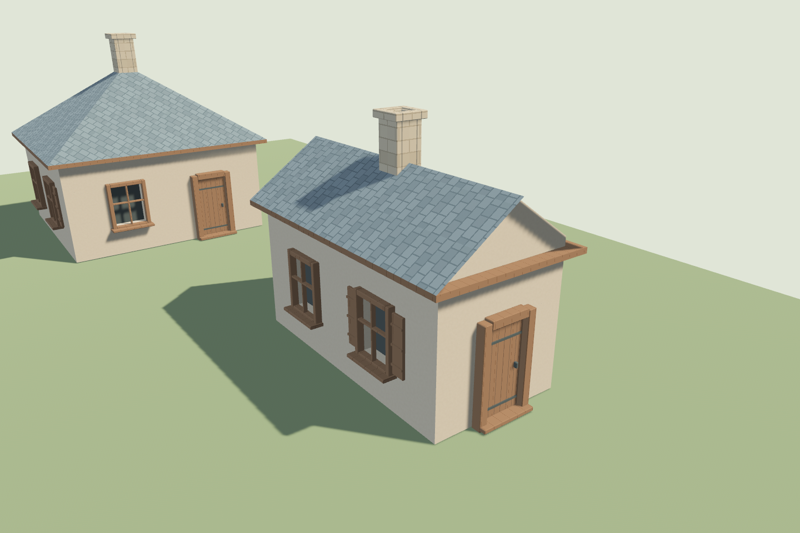

# Tiny Garden · Bevy 模块基础

这是自由建造微缩庭院游戏的**桌面编辑原型**，不是已经完成的游戏。当前实现鼠标/工具 → 编辑事务 → 异步布局/网格生成 → Bevy 投影与 3D 展示，并接入首批原创 Blender 门窗、烟囱与烘焙贴图。纯核心与默认测试不要求 GPU / Android SDK。

产品边界：原创石木美术、先做 Windows 桌面鼠标版，触摸与手机后续移植；P0 多层建筑外观，不做室内、养宠或游戏手柄。

当前开发顺序和验收以[桌面版开发计划](docs/桌面版开发计划.md)为准，不再以 Android 真机包作为首个交付关口。

下一阶段的玩法核心与通用化设计见[上下文自动重构系统架构](docs/上下文自动重构系统架构.md)：窗户组合、道路连接及笔画随参数变为路/篱笆/围墙。现有工具和增量管线是基础，这些自动重构玩法尚未实现。

## 模块

| crate | 责任 |
|---|---|
| `garden-geometry` | 无引擎矩形运算与退台区域切分 |
| `garden-domain` | 建筑聚合、体块、楼层、屋顶意图、合法性约束 |
| `garden-application` | 命令、预览、撤销重做、版本与最新生成请求 |
| `garden-generation` | 布局、墙面开孔、三屋顶、米制 UV、纯 Mesh 缓冲 |
| `garden-bevy` | Plugin、后台任务、帧预算、投影更新通知、生成错误 |
| `garden-presentation` | 主题/资产合同与检查器；desktop 可选启用 3D 展示 |

说明、依赖方向、扩展方案和后续任务见 [模块架构](docs/模块架构.md)，验证结果见 [验证记录](docs/验证记录.md)。

美术怎样制作、先做什么、由谁交付、如何验收见 [美术资产制作计划](docs/美术资产制作计划.md)；基础窗 Blender 起步模板见 [美术源工作区](art-source/README.md)。

## 运行

### IDE 一键运行

在 RustRover / IDEA 中打开 `D:\game\tiny-garden`，等待 Cargo 同步后，打开 [游戏入口 main.rs](crates/presentation/src/main.rs)，点击 `fn main()` 左侧绿色 ▶。IDE 默认会根据目标的 `required-features = ["desktop"]` 补齐桌面功能；若关闭过自动功能选项，可以直接选择项目共享配置 [Run Tiny Garden](.run/Run%20Tiny%20Garden.run.xml) 启动，它已显式填写 desktop。

游戏只有一个入口：`src/main.rs` → `app::run()`；窗口/插件/场景组装集中在 `src/app.rs`。`src/bin/art-check.rs` 的 `main()` 属于另一个独立的美术检查程序，不会同时执行。Cargo 的 `default-run` 已设置为游戏目标 `tiny-garden`，不再误选检查器。旧 `src/bin/showcase.rs` 已迁移，旧文档/日志中的 showcase 命令对应当前 tiny-garden 目标。

### 终端运行与检查

Rust ≥ 1.95；Bevy 基础子库固定为 0.19.1，依赖版本记录在 `Cargo.lock`。首次构建可能需要联网下载依赖。

dev profile 优化外部依赖（opt=3、debug=false），并选择性优化 generation（opt=2）与 presentation/adapter（opt=1）；其他核心保留未优化调试。首次重编成本和实际迭代测量见验证记录。生成任务固定跑在 `GardenPlugin` 自有的 `TaskPool` 上，不与渲染器的着色器管线编译争线程。

```powershell
cd D:\game\tiny-garden
cargo test --workspace --all-targets --locked
cargo clippy --workspace --all-targets --locked -- -D warnings
./scripts/check-boundaries.ps1
cargo run -p garden-bevy --example headless --locked
cargo run -p garden-generation --example layout_benchmark --release --locked
cargo run -p garden-presentation --bin art-check --locked
cargo run -p garden-presentation --features desktop --bin tiny-garden --locked
```

`headless` 打印变化与撤销结果，不打开窗口；微基准分别测 CPU 布局和网格，不测 GPU/手机帧率。

`tiny-garden` 载入六座示例建筑，包括 1–4 层、三屋顶和退台；示例载入不占用玩家撤销历史。可以继续在草台上建造，当前跨建筑重叠不做融合或阻止。

| 工具/操作 | 用法 |
|---|---|
| 选择 / 切换体块 | 左键点击实际可见网格选中对应体块；按钮可轮换体块；黄色框不是精确轮廓描边 |
| 建造 | 左键拖出矩形；松开创建，最小 1.2×1.2m，限制在当前草台范围内 |
| 移动 / 移动体块 | 前者移动整栋；后者移动选中的上层及其后代，超出承托则拒绝 |
| 尺寸 | 橙点独立调宽、蓝点独立调深；也可拖动体块同时调宽深；只修改所选体块，不拉伸门窗 |
| 高度 / 旋转房屋 | 绿点或高度工具上下拖动；紫点围绕底层中心旋转整栋；松开提交一次 |
| 添加上层 / 删除上层 | 在所选体块上创建居中退台；删除上层连同后代；1–3 体块、总支撑链不超过 4 层 |
| 平移 | 左键拖动地面平移镜头；不修改作品/撤销历史 |
| 切换屋顶 / 切换立面 / 增高 / 降低 / 删除房屋 | 前四项只改当前体块；立面轮换石/灰泥/木，删除房屋删除整栋 |
| 撤销 / 重做 | 通过现有命令历史恢复编辑，取消预览不记历史 |
| 右键拖动 / 滚轮 | 旋转视角 / 缩放；另有左转、右转、抬高/降低视角、放大/缩小、复位视角按钮 |

拖动时即时显示半透明的简化墙体/屋顶和线框，使用固定资源池，不重建或拉伸正式门窗；提交后有效目标预览保留到正式版本完成交接。四坡预览为简化四坡体，不是完整贴图建筑。红框/红色预览或错误提示表示不能提交；右键、「取消」、失焦、离开窗口或在 UI 上松开会取消拖动。队列满时保留命令供重试或取消；缩小底层导致失去承托时拒绝，不偷偷移动或删除上层。

有效命令提交后有青色目标轮廓/中文进度，根移动/旋转连续重定向，拓扑变化用短整组淡化。M1 工具的代码与自动回归已接入，真实鼠标/窗口中断与全 DPI 验收仍待做；不做万级场景扩展。UI 均为中文，附带 Noto Sans SC 字体及 OFL 许可。触摸和全量美术未完成；没有存档，关闭会丢失作品。

离屏截图不打开窗口，需 GPU 渲染支持；输出路径不得已存在：

```powershell
cargo run -p garden-presentation --features desktop --bin tiny-garden --locked -- --capture D:\game\tiny-garden\art-source\reference\new-review.png
# 建造第七屋、增高/等待过渡、未提交尺寸预览，验证 GPU 链路：
cargo run -p garden-presentation --features desktop --bin tiny-garden --locked -- --review-capture D:\game\tiny-garden\art-source\reference\new-edit-review.png
# 创建退台上层、调高与旋转，展示控制点（不是 OS 鼠标回放）：
cargo run -p garden-presentation --features desktop --locked -- --tools-review D:\game\tiny-garden\art-source\reference\new-tools-review.png
```

现在六座样例与新建房屋均使用 `house-kit-v4`：基础窗、窗板窗、木门、石烟囱，以及石墙/灰泥/木板/屋瓦的 BC、N、ORM 贴图。门占用真实门洞，窄房不强塞门；平顶不加烟囱、上层独立适配。主体不是固定 GLB，Size / Height / Roof / Undo 后按受影响部件增量更新。

Blender 同源导出 GLB 和 `kit.json`；游戏在后台按墙面/屋顶/楼层附件组生成与复用，PNG 由 AssetServer 加载。分块共享 5 种材质，不等于每屋最多 5 个绘制批次；新增上传有字节/批次预算。**不是直接加载整栋 GLB SceneRoot**。四个 GLB 已通过 Khronos 格式与同源网格/UV 校验，见[美术工作区](art-source/README.md)与[首批验收](docs/房屋资产首批验收.md)。

清单当前 4 项 blockout、22 项 planned，未将桌面样片冒充正式全量资产；`art-check --strict` 仍会拒绝，这是预期行为。当前窗中心是伸长适配，不是重复瓦片式中心重构；远景 LOD 切换尚未接入。



无 UI 美术近景截图：`tiny-garden --art-closeup 新文件.png`。相机初始正面视角调整为 `(34,32,-46)`，可查看门与立面；它没有改变镜头工具的交互。

## 从哪里读

1. `domain/src/lib.rs`：`BuildingDraft` → `Building::try_new` → `Building::edited`。
2. `application/src/lib.rs`：`Editor::execute`、`Preview`、`JobTicket`。
3. `generation/src/lib.rs`：`compile`，看建筑参数怎样产生布局变化。
   再看 `generation/src/mesh.rs`：墙面带状切分、屋顶、法线与 UV。
4. `bevy-adapter/examples/headless.rs`：应用如何使用插件与编辑入口。
5. `bevy-adapter/src/lib.rs`：Commit → Collect → Dispatch 的系统顺序。
6. `presentation/src/renderer.rs`：仅消费更新通知，分材质上传、替换与资源回收。
   `generation/src/incremental.rs`：稳定部件、精确缓存 key、局部偏移、增量复用；`bevy-adapter/src/prepare.rs`：后台切线。实现/预算/CPU 基准见[优化实现与验收](docs/优化实现与验收.md)。
   `presentation/src/building_kit.rs`：验证 Blender 编译件、门洞适配、固定框/中段映射、附件合批；编译策略通过 `ProjectionCompiler` 注入后台任务，不反向依赖表现层。
7. `application/src/tools.rs` 与 `presentation/src/pointer.rs`、`editor.rs`：纯拖动事务、手势所有权、屏幕射线与 UI 接入。

路径均位于 `crates/` 下。暂时不创建无实现的道路、UI、存储和平台 crate；达到真实依赖边界时再拆分。

接 UI 时必须消费 `EditFeedback::drain()`；反馈满时提交系统会暂停，避免静默丢失命令结果。`QueueFull` 应显示繁忙反馈或保留待提交事务重试，不能把失败误报成编辑成功。
