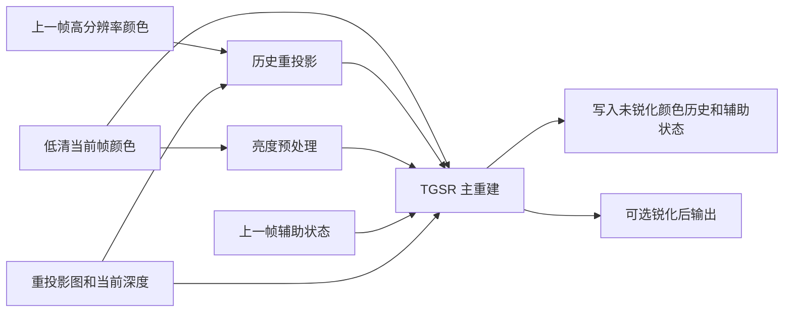

# Tiny Glade 1.14.3 中的 TGSR 实现分析

分析日期：2026-10-10。对象为本地 1.14.3 安装包中的 `tiny-glade.rne`、匹配的 PDB、六个 TGSR 编译着色器和一个重投影图生成着色器。本文沿用对话中的“TGSR 1.0”称呼；二进制中的实际模块名为 TGSR，本次没有发现内部语义版本号“1.0”。

结论：这是通过低分辨率抖动采样、历史重投影、YCbCr 邻域统计、自适应历史限制和加权累积完成的时域超分辨率实现。已读路径的滤波逻辑是显式数学规则，未发现神经网络权重或网络推理结构。该结论限于本次解析的旧版 TGSR 路径。

本次为静态分析，未运行目标游戏、未捕获 GPU 帧，也未完成视觉或性能验证。CPU 证据来自 LLVM 汇编与 PDB；GPU 证据来自按 Khronos 机器可读语法解码的 SPIR-V。解码保留了原文件偏移、指令与源文件行号信息。源码文本字段只有空白，下面的数学式和伪代码是依据指令重写，不是恢复的原始 HLSL/Rust 源码。

## 1. 实际数据流



CPU 的 `calculate_tgsr`（RVA `0xA3BA60`）依次构建并记录 `TGSR blur lum`、`TGSR reproject`、`TGSR` 三个计算通道，并实际调用 `PassBuilder::render`。这是已确认的图记录顺序，未声称观察到了 GPU 的实际执行时间线。

输入颜色为低清世界渲染结果。输出、颜色历史、重投影后的亮度/色度和辅助历史使用最终输出分辨率；模糊亮度使用低清输入分辨率。后面还有 `post_taa_transparency_pass`，因此不能把 TGSR 输出等同于已经完成全部透明物体和界面的最终交换链画面。

## 2. 分辨率与亚像素抖动

CPU 函数 `UpscalingPreset::tgsr_resolution_scale`（RVA `0x968BB0`）读取质量比例表，名称通过枚举 Display 跳转表核对：

| 质量档 | 渲染宽高相对输出宽高 | 理论像素量占比 |
| --- | ---: | ---: |
| UltraPerformance | 1/3 | 11.11% |
| Performance | 1/2 | 25.00% |
| Balanced | 0.581395328，约 1/1.72 | 33.80% |
| Quality | 2/3 | 44.44% |
| UltraQuality | 0.769230783，约 1/1.3 | 59.17% |

像素占比为线性比例的平方，不包含整数取整、分辨率对齐、后处理和固定开销，因此不是测得的性能提升。具体运行时的分辨率取整和默认档位未核对。

`TaaJitterSet::default`（RVA `0xC97500`）建立序号 `1..=128` 的 Halton(2,3) 样本，每个坐标减去 0.5，形成居中的亚像素偏移。`prepare_frame_constants` 按帧序号对样本数量取模，实际调用 `ViewConstants::set_pixel_offset`。开关关闭时偏移归零。

这使低清像素在不同帧采到不同子像素位置，为跨帧重建提供信息。它不能保证恢复从未采到的细节，运动和显露区域仍依赖当前帧重建。

## 3. 重投影图：不只有二维运动向量

`_calculate_reprojection_map.cs.hlsl_cs_main_0.bin` 输入当前深度、前帧深度、物体速度，以及当前/前帧相机矩阵和采样偏移。输出四个通道：

| 通道 | 已读到的处理 |
| --- | --- |
| XY | 当前像素到前帧位置的 UV 位移，使用 `floor(delta_uv × 32767 + 0.5) / 32767` 量化。相机变化与物体速度共同参与位置映射。 |
| Z | 前帧 2×2 深度候选是否有效的四位掩码，按 `[1,2,4,8]` 加权后除以 15。检查中包括深度差及候选像素边界。Z=0 表示没有通过的候选，Z=1 表示四个候选全部通过。 |
| W | 深度差正负两侧的共同出现标记，加上物体速度投影后的运动长度。主重建据此调整历史限制强度。 |

深度为零的天空路径另行计算相机重投影并检查 UV 边界，不执行相同的物体表面深度验证。Z、W 因此不能简单称为统一的“运动向量 ZW”或连续置信度。

## 4. 亮度预处理

`_tgsr_blur_lum.cs.hlsl_cs_main_0.bin` 的计算组为 8×8×1。指令显示两个循环分别从 -1 到 +1，总计 3×3 个采样位置，位置间隔对应两个输入像素，并扣除采样抖动。

核心计算为：

```text
Y = dot(rgb, [0.2126, 0.7152, 0.0722])
w(i,j) = exp(-0.75 * (i*i + j*j))
blurred_luminance = sqrt(sum(w * Y) / sum(w))
```

这是九个位置组成的亮度低频参考，不等于一个完整连续的 5×5 核。结果写入低清 `R8_UNORM`。主阶段读回后平方，使其重新参与亮度差异比较。

## 5. 历史重投影

`_tgsr_reproject.cs.hlsl_cs_main_0.bin` 的计算组为 8×8×1。输出像素先映射到低清深度/重投影图坐标，再读取周围的重投影 XY。若这些位移分歧明显，则搜索当前深度的 3×3 邻域，并选择较大深度值对应的位置作为位移来源。这是减少深度边缘上背景位移污染前景的处理；“较大深度代表较近表面”依赖该渲染器的深度约定，本文保留实际比较方向。

历史位置使用 `current_uv + reprojection.xy`。随后以五次图像采样组成三次重建滤波，权重系数符合 Catmull–Rom：合并中间两项、使用十字形五个采样位置，并按保留权重之和归一化。与完整 4×4 历史采样不应混为一谈。

重建颜色转换成 YCbCr：

```text
Y  =  0.2126 R + 0.7152 G + 0.0722 B
Cb = -0.1146 R - 0.3854 G + 0.5 B
Cr =  0.5 R - 0.4542 G - 0.0458 B
```

Y 和 Cb/Cr 分别写入两张输出分辨率纹理。CPU 历史有效标志及帧索引检查不通过时，此阶段将历史颜色置零。

## 6. 当前帧重建与邻域统计

主着色器读取低清颜色时，按照当前采样偏移进行 unjitter，并读取低清 3×3 邻域。每个样本先转成 YCbCr，然后分别累积重建颜色、统计一阶矩和二阶矩。

指令中存在两套不同宽度的距离权重：一套用于当前颜色重建，另一套用于均值和方差统计，不能把它们误写成同一个固定高斯核。以代码中的位置差 `d` 和横向线性比例 `s` 表示，权重包含：

```text
w_statistics = exp2(-dot(d,d) * s*s)
w_reconstruct = exp2(-dot(d,d) * 10*s*min(4*s,1))
mu = sum(w_statistics * color) / sum(w_statistics)
sigma = sqrt(max(E[color*color] - mu*mu, 0))
current = sum(w_reconstruct * color) / sum(w_reconstruct)
```

这里的 `d` 在输出像素坐标域计算，不能把公式中的系数直接移植为任意坐标域的核半径。

## 7. 自适应历史限制与融合

主阶段还读取 3×3 重投影历史邻域，统计其亮度均值、亮度方差，以及历史样本超过当前 `mu ± 2*sigma ± 0.001` 范围的比例。指令路径中用 Y 和 Cr 的越界比例参与限制状态计算，不能笼统宣称三个通道的所有越界统计都同样影响控制量。

限制状态综合以下信息：前帧辅助状态、历史亮度相对方差、历史邻域越界比例、当前与历史的模糊亮度差、局部运动、深度有效掩码，以及重投影图 W。这个状态不是已恢复原变量名的“神经网络置信度”，本文用 `restriction_score` 表示其控制作用。

已直接恢复的核心公式为：

```text
gamma = exp2(7 * saturate(1 - restriction_score) - 0.5)
history_limited = clamp(history_ycbcr, mu - gamma*sigma, mu + gamma*sigma)
```

当状态增大时，gamma 变小，历史允许范围收紧；反之范围放宽。关闭邻域限制的调试路径会绕过该 clamp。此机制可限制与当前邻域不相符的旧颜色，拖影改善属于算法目的和合理推断，本次没有测量实际效果。

融合不是固定比例的简单混合：

```text
H = min(4, adjusted_previous_accumulation)
W = sum(current_reconstruction_weights)
history_fraction = H / max(W + H, 1e-5)
result_ycbcr = lerp(current_ycbcr, history_limited, history_fraction)
result_rgb = max(YCbCrToRGB(result_ycbcr), 0)
```

历史无效时另走仅当前帧颜色重建的路径，不继续混入失效历史。

## 8. 两种历史资源与锐化

颜色历史保存未锐化的主重建结果。`tgsr_aux` 的两个通道保存下一帧需要的限制状态和归一化累积权重；它不是颜色图，也不是简单的“历史帧数”。CPU 用 temporal pair 交换前帧/当前帧角色。

主通道写出的状态包含：

```text
aux.x = clamp(score_before_extra_W + 2*saturate(reprojection.w*1000), 0, 2) / 2
aux.y = (W + H) / T
T = bypass_neighborhood_clamping ? 16 : 4
```

下一帧读取 X 后乘 2，读取 Y 后乘 T，然后根据当前局部统计调整累积权重。`R8G8_UNORM` 在写入时还会量化和限制取值范围。

`PERM_sharpen` 变体把亮度存入 `tile_luminance` 工作组共享数组，执行 `OpControlBarrier`，再依据邻近亮度差和 `sharpen_amount` 做受限锐化。最后将 RGB 按新的亮度比例调整。此操作发生在写颜色历史之后，所以锐化反馈不进入下一帧的颜色累积。

写入紧凑浮点 RGB 之前还执行 `FrexpStruct` 和 `Exp2`，加上与通道指数相关的偏移。这个量与 R/G/B 存储格式的半个 ULP 对应，属于低精度写入的量化偏移；“避免持续向下截断偏差”是对该操作目的的推断。

## 9. 缓冲格式与着色器变体

格式数值由 CPU 纹理 descriptor 指令确认，名称对照 [Khronos Vulkan 官方头文件](https://raw.githubusercontent.com/KhronosGroup/Vulkan-Headers/main/include/vulkan/vulkan_core.h)。

| 资源 | 分辨率 | 格式 |
| --- | --- | --- |
| blurred luminance | 低清输入 | R8_UNORM |
| reprojected history lum | 最终输出 | R16_SFLOAT |
| reprojected history chroma | 最终输出 | R16G16_SFLOAT |
| tgsr_aux 前/当前帧 | 最终输出 | R8G8_UNORM |
| tgsr_history 前/当前帧 | 最终输出 | B10G11R11_UFLOAT_PACK32 |
| TGSR 输出 | 最终输出 | B10G11R11_UFLOAT_PACK32 |

| 主着色器文件尾部标识 | 工作组 | 锐化路径 |
| --- | --- | --- |
| 7a0af18450cdbcd1 | 8×8×1 | 无 |
| b303f36f0dbdd5f6 | 8×4×1 | 无 |
| 3ee6a953408e4c4c | 8×8×1 | 有 |
| f7efabb81dfe256b | 8×4×1 | 有 |

两个无锐化变体的指令逐项比较表明，除工作组大小、临时源文件名和编译命令元数据之外，指令一致。CPU 的 `PERM_wave32` 依据设备提供的最小 subgroup size 是否存在且不大于 32 选择；`PERM_sharpen` 依据锐化量是否大于零选择。因此四个文件是两种工作组与锐化开关的组合，不是四套超分辨率算法。

## 10. 历史有效性与尚未确认的边界

CPU 的主重建有效条件为 `color_history.valid && aux_history.valid && !FORCE_TAA_PASSTHROUGH`；历史重投影只要求颜色历史有效及该调试开关未启用。GPU 还检查帧索引不能为零。

已确认：首次创建历史资源返回无效；宽高/深度改变时重新创建资源并返回无效；辅助双缓冲的有效性按 AND 合并。未确认：相机跳变、切换林地、载入场景等事件是否另外触发失效，以及所有特殊场景的重置顺序。

本轮也没有确认实际默认质量档/锐化量、输入颜色曝光处理的位置、通用图执行器最终的 Vulkan dispatch，以及各阶段 GPU 耗时。包内数学与资源布局足以解释主实现，但尚不能宣称逐像素等价复现或验证视觉效果。

## 11. 用于原创项目的实现顺序

以下是设计建议，不是对原程序行为的新增事实：先建立稳定的速度/深度重投影、Halton 抖动与明确的历史失效规则；随后实现当前邻域重建和 YCbCr 均值/方差限制；再加入累积权重、亮度参考和遮挡处理；最后独立添加输出锐化和紧凑格式量化处理。建议先用易调试的高精度缓冲验证运动、显露和建造编辑，再优化存储与 GPU 子组操作。

## 12. 证据定位

| 编号 | 证据与定位 |
| --- | --- |
| TG-E01 | 本机 `TinyGlade_逆向初查/tgsr-analysis/shader-summary.json`：七个文件的 SHA-256、工作组、资源绑定、成员名、常量和指令计数。 |
| TG-E02 | `_tgsr_blur_lum...body.txt`：原 HLSL 行 22–39 对应循环、权重、亮度、平方根与写入。 |
| TG-E03 | `_tgsr_reproject...body.txt`：原行 51–119 对应深度/位移选择；`inc/image.hlsl` 行 110–166 对应五个历史采样；原行 153–157 对应有效性与 YCbCr 输出。 |
| TG-E04 | `_tgsr...7a0af18450cdbcd1.body.txt`：`inc/unjitter_taa.hlsl` 行 78–150 对应当前重建与统计；主文件行 206–390 对应状态及 clamp，464–489 对应融合与无效历史，495/643/646–648 对应三项输出。 |
| TG-E05 | `_tgsr...3ee6a953408e4c4c.body.txt`：原行 495、537–564、643 对应先写历史、共享亮度锐化、再写最终输出。 |
| TG-E06 | `_calculate_reprojection_map...body.txt`：原行 83–99 对应速度与 XY 映射；134–176 对应前帧深度有效掩码和 W。 |
| TG-E07 | `host/calculate-tgsr-annotated.txt`：RVA 0xA3BA60 处 CPU 通道顺序、输入/输出 extent、资源格式和 uniform；`host/tgsr-caller-annotated.txt`：RVA 0x4ECFEF 处 TGSR 调用及后续透明通道。 |
| TG-E08 | `host/temporal-aux-pair.txt`、`host/temporal-get-or-create.txt`：RVA 0x96D490/0x96CE90 处双缓冲、尺寸变更与有效性。 |
| TG-E09 | `host/jitter-default.txt`、`host/jitter-iterator.txt`、`host/prepare-frame-annotated.txt`：128 个居中 Halton(2,3) 偏移和实际应用。 |
| TG-E10 | `host/tgsr-shader-uri-annotated.txt`：RVA 0xA3E100 处两个 permutation 宏；质量查表 RVA 0x968BB0、常量表 VA 0x142AB572C。 |

机器可读语法参考：[Khronos SPIR-V Grammar](https://registry.khronos.org/SPIR-V/specs/unified1/MachineReadableGrammar.html)。本机详细证据位于 `D:\game\TinyGlade_逆向初查\tgsr-analysis\`，安装原件保持原样。
