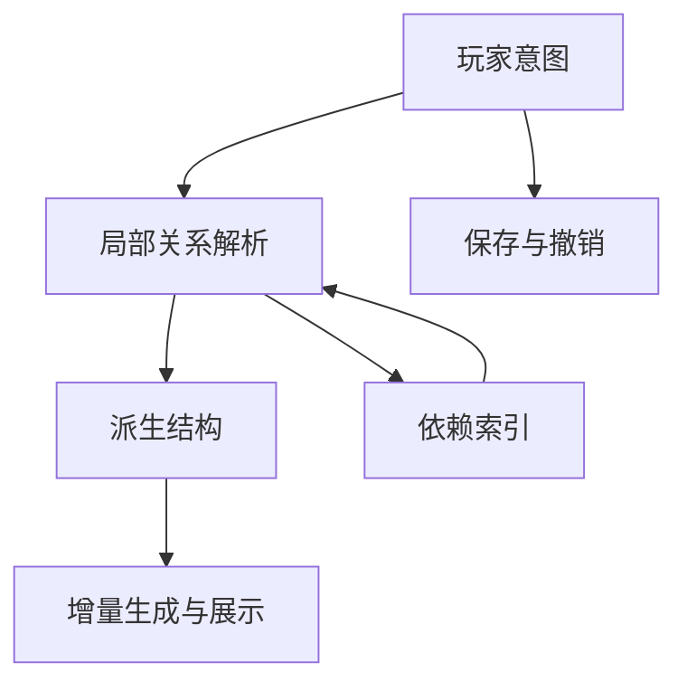

# 上下文自动重构系统架构

2026-10-09。面向 Windows 桌面庭院创作的架构设计，重点是窗户组合、道路连接，以及同一笔画随参数变化成为道路、篱笆或围墙。本文保留总体机制和实施顺序，不推断 Tiny Glade 的内部代码。2026-10-10 已接入三态、路网、连窗/门窗休眠、地形地基及共享事务/展示机制；具体代码、操作、增量边界及实际验收见[上下文系统实现与验收](上下文系统实现与验收.md)。文中的接口草图和未来扩展仍以该实现记录为准。

## 设计目标与通用边界

产品核心是让玩家编辑形状和关系，系统理解局部上下文并重新生成合理结构，而不是分别放置互不相关的模型。保存玩家意图，解析局部关系，生成合理结构；再次操作时重新解释，不能破坏原始数据。

通用化的是处理流程与数据合同，不是所有玩法的几何算法。编辑事务、预览、取消、历史、身份、来源追踪、邻近查询、依赖失效、后台任务和一致展示可以共享；连窗、路口、篱笆连接、围墙转角、门洞和屋顶仍使用各自的类型与解析器。

不采用属性字典式万能 Object、全场反复迭代的规则引擎、通用约束求解器或提前建设规则脚本 DSL。先验证具体玩法，再从真实重复部分抽象公共机制。

## 四层数据模型

### 玩家意图

权威数据保存玩家实际操作的对象。例如窗户 A、B 分别保存所属墙面、沿墙位置、宽高与样式；道路笔画保存原始轨迹与参数。即使展示上合并成一个结构，原始对象仍保留，可拖开、撤销和恢复。

线性结构可以使用共同的意图类型；建筑与开口仍保持自己的强类型。以下仅为接口草图，不是已经实现的 Rust 类型：

```rust
struct StrokeIntent {
    id: StrokeId,
    path: Vec<ControlPoint>,
    width: f64,
    structure_height: f64,
    elevation_offset: f64,
    mode: StructureMode, // 自动解析或显式锁定
    style: StyleId,
}
```

structure_height 表示从地面生长出的结构高度；elevation_offset 表示整体离地偏移。“拉高变成围墙”优先解释为结构高度改变，不是把路面悬空，否则与桥梁、架空平台混淆。地面采样应经明确接口输入解析器，不由领域读取 Bevy World。

窗户仍使用 OpeningIntent，建筑仍使用 BuildingIntent；不为了统一而失去 Rust 的类型检查和各领域不变量。

### 对象关系

关系表达组合、连接、穿越、承托等语义。距离只用于找候选，不是最终决策。

| 关系 | 必须检查的条件 |
|---|---|
| 窗户组合 | 同一宿主墙面、垂直位置、样式兼容、间距与整体跨度 |
| 道路连接 | 平面位置、地面高度、端点或交叉类型 |
| 篱笆连接 | 高度、材料、端点方向 |
| 道路成门 | 实际墙面穿越、有效宽度、合法开口区域 |
| 体块承托 | 轮廓包含、层数、支撑方向 |

关系记录来源对象、宿主锚点、参数区间和影响范围，并进入依赖索引。删除、移出旧位置或类型改变都能撤销原关系。

### 派生结构

解析器输出语义结构，不直接创建网格实体。例如两窗组成 OpeningAssembly，包含来源窗户、开口布局、公共窗框和中间分隔构件；道路组成 PathNetwork，包含路段、接点、交汇口及连续路面区域；一条笔画当前解析为 Path、Fence 或 Wall。

派生结构是可重建的结果，不替代玩家原始意图。类型变化不需要删除权威笔画并创建新对象。

### 运行时展示

最终几何编译器生成墙洞、窗框、路面边缘、立柱、压顶和拾取代理。网格、材质句柄、动画实体和渲染缓存不进入权威作品数据。



## 三类自动重构机制

### 窗户的外观组合

窗户身份保留，展示组合改变。规则需明确进入与退出间距、垂直对齐、样式冲突、成员数量、最大跨度、合法墙面区域，以及拖开后的恢复方式。

A 靠近 B、B 靠近 C，不足以直接推断三窗可以组成巨型连窗。先建立局部候选，再用组合级约束检查整组，不仅检查两两距离。开口必须来自合法的结构组合，不能不加校验地用大包围矩形挖洞。

玩家移动一个成员时更新该成员的原意图，然后重新计算组合；不在每次靠近时删除原窗户。

### 道路的网络连接

道路保留笔画来源，生成共享连接拓扑。第一版明确支持端点接端点、端点接中段形成 T 字口、中段交叉，以及宽窄路段交接。近而未接触、平面交叉但高度不同等情况必须有明确规则，不能只按二维距离连接。

网络拓扑和路面融合分开：先确定节点与边，再生成连续路面和接头。几何并集可以辅助路面生成，但不替代路网语义。移动或删除一笔后，局部节点、边和路面重新解析，其他区域保持不变。

### 笔画的结构类型变化

同一笔画根据结构高度、宽度、样式倾向、地面关系、邻接类型和玩家锁定状态解析为道路、篱笆或围墙。高度阈值只是其中一个条件，不是通用换模型开关。

族内自动变化，族间通过关系协作。线性地面与边界结构、建筑体块、墙面开口构成不同结构族；不允许任意对象隐式变成任意类型。

类型变化还需重新评估邻接关系。道路连接、篱笆端柱连接和围墙转角不是同一种连接；新类型不能沿用已经失效的关系结果。

## 专用解析器与公共管线

| 解析器 | 输入 | 输出 |
|---|---|---|
| LinearStructureResolver | 笔画、地面、样式和锁定状态 | 路道、篱笆或围墙结构 |
| PathNetworkResolver | 有效道路与邻近候选 | 路段、接点、路口 |
| OpeningAssemblyResolver | 同宿主墙面的手工开口 | 连窗组合和开口布局 |
| BoundaryCrossingResolver | 路网与墙面 | 自动门或通道请求 |
| FacadeResolver | 墙面、自动门和手工窗 | 最终开口、活跃与休眠覆盖、立面构件 |
| BuildingResolver | 体块和承托 | 楼层、有效屋顶、退台 |

每个解析器接收不可变输入，输出确定结果或明确诊断，不修改其他解析器或权威数据，不读取 World，不创建 Entity，不负责动画。公共协调器管理快照、依赖、版本、失效和调度，不掌握窗框、路口的具体几何。

初期使用具体 Rust 类型、枚举和纯函数。只有真实出现可替换实现时才增加 trait；不要先建立动态插件注册和反射属性框架。

## 解析阶段与规则优先级

采用有向分阶段流程，尽量避免循环依赖：

```text
原始意图
 → 类型与宿主解析
 → 同类组合与网络
 → 跨类关系
 → 最终结构
 → 几何与展示
```

道路影响建筑的处理顺序是：笔画类型 → 路网 → 墙面穿越 → 自动门请求 → 门窗冲突解析 → 墙洞与框架。门洞不反过来隐式改写道路意图。

冲突优先级应按玩法明确配置：显式锁定优先于自动类型推断；自动门与手工窗的优先级按已有开口契约；自动窗避让有效手工覆盖；无法显示的手工窗进入休眠，保留参数。不同组合的胜出顺序不能依赖容器遍历或任务完成顺序。

若未来出现真正的双向约束，只为该玩法引入有边界的局部求解和失败策略，不让全场规则反复运行直到偶然稳定。

## 关系失效与局部增量

增量单位由单栋建筑扩展为关系影响范围。依赖可能是道路 → 路口 → 建筑某墙面 → 自动门 → 休眠窗户。更新时必须同时包含旧范围、新范围、既有关联和新候选，否则离开原位置后会留下门洞或接头。

处理步骤：

1. 捕获变更前后的意图和范围。
2. 从旧关系索引及邻近查询取得候选。
3. 在一致输入快照上重新解析。
4. 比较旧新关系与派生结构。
5. 使真实变化的几何部件失效。
6. 安装结果后同步更新依赖索引，拒绝过期结果。

区分计算影响组和展示一致性组。路网连通不代表整张路网都要重建或淡化；通常重算局部接点和受影响边，展示只协调相邻接头、路面、洞口等必需部件。

当前庭院规模先用线性扫描或简单网格查询，隔离查询入口；不新增万级世界、流式加载或 LOD 项目。昂贵几何仍复用既有稳定 PartId、精确输入 key、后台切线、取消和预算上传机制。

## 稳定身份与来源追踪

ObjectId 标识玩家意图，RelationId 标识组合或连接关系，PartId 标识生成部件。来源信息连接派生结构与原始对象；必要时包含笔画区间、墙面锚点及成员角色。

点击公共窗框可选择组合，点击具体窗扇可追溯原始窗户；拖动单个成员后重算组合。道路的连续路面也要保留笔画来源，不能因融合而丢失可编辑性。

窗户锚定建筑体块、语义墙面和沿墙参数，不锚定临时 Mesh 顶点或三角形编号。路口可由稳定来源及接入区间匹配；拆分合并确实造成部件出生退出时，通过来源重叠做展示交接，不伪造永不改变的部件身份。

身份匹配不得把几何位置作为唯一依据；成员排序、区间排序和并列决策需要稳定顺序，避免改变无关对象导致整个场景重新随机化。

## 预览与事务

预览和正式提交共用语义解析器，只允许几何精度和装饰细节不同。拖动阶段就展示是否组合、是否接入道路、是否形成门洞或改变类型，不能松手后才突然换成另一种结构。

手势开始捕获版本和初始参数；移动只修改候选意图及临时关系；取消丢弃候选；提交一次应用意图变更；自动关系与结构变化属于同一历史操作。撤销恢复意图后重新解析，不为每个自动附件追加历史。

关系阈值具有迟滞，进入组合和退出组合条件不同，防止边界抖动。手势内部的临时锁定不泄漏到正式世界；若已提交结构的选择依赖历史锁定，必须将该决策显式保存和撤销，或以规范化规则确定唯一结果，不能把语义藏在渲染缓存里。

预览使用候选快照，不污染正式依赖索引。跨对象提交需要一起验证版本和合法性，不能先提交道路、后发现墙面解析失败却留下半个事务。

## Bevy 工程边界

| 模块 | 新职责 |
|---|---|
| domain | 建筑、笔画和开口意图，身份、锚点、基本不变量 |
| application | 跨对象编辑事务、预览、历史、变更集合、关系协调用例 |
| geometry | 距离、线段交点、折线扩宽、区间合并等基础运算 |
| generation | 类型化解析器、关系与派生结构、确定性几何编译 |
| bevy-adapter | 不可变依赖快照、任务调度、票据校验与投影发布 |
| presentation | 输入意图、拾取来源、组合反馈、候选预览和关联过渡 |

调度票据必须捕获相关对象、宿主和规则版本，不能只验证建筑自身修订号。道路移动、墙面变化或作品切换都会使旧结果失效。解析阶段不能未经用例把生成结果反向写入领域。

原有六 crate 和四个无引擎核心保留；建筑控制点是输入基础，部件增量是显示基础，新核心位于二者之间。存档仍只保存意图及确需恢复的决策、schema/rules 版本，不保存 GPU 句柄。

## 实施顺序与验收

先实现具体切片，再提炼公共管线：

1. 一笔三态：道路、篱笆、围墙之间变化，轨迹与身份保留，可降回、取消、撤销。
2. 两路连接：端点、T 字口、交叉、移动拆开、删除恢复；拓扑与路面一致。
3. 两窗组合：同墙面拖近组合、拖远拆分、越界休眠、撤销保持来源身份。
4. 道路成门：验证跨类依赖、开口优先级、墙洞与框架一致交接。

每个切片同时验证相同输入结果稳定、遍历顺序无关、临界操作不抖动、取消撤销恢复、局部失效、预览与提交语义一致、过期结果拒绝和资源回收。类型、关系和拓扑改变分别测试，不以按钮存在或静态截图认定闭环完成。

最终架构是类型化玩家意图、专用局部解析器、可追踪派生结构与通用增量展示管线。当前 M1 建筑工具与[优化实现](优化实现与验收.md)作为基础保留；下一阶段优先验证上下文自动重构，不继续以增加独立搭建按钮作为产品中心。
