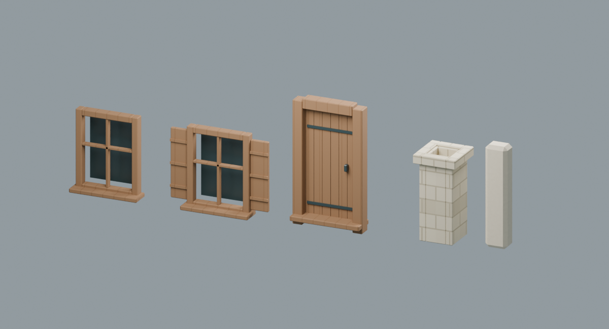
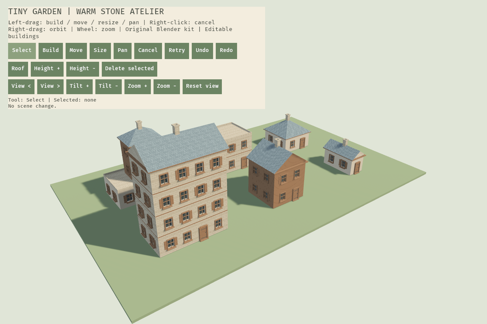

# 房屋资产首批验收

2026-10-09 · Windows / Bevy 0.19.1 / Blender 5.2.2 LTS · 仅本地修改，未提交或推送。

结论：**SHIP WITH NOTES（允许桌面原型接入，不等于全部生产资产获批）**。

## 交付范围

| 模块 | 三角形 / 预算 | 材质 / 预算 | 使用 |
|---|---|---|---|
| window-basic | 320 / 500 | 2 / 2 | 基础窗、窄立面 |
| window-shutter | 480 / 800 | 2 / 2 | 窗板变体，空间允许时交错布置 |
| door-timber | 316 / 500 | 2 / 2 | 宽度至少 3m 的底层正面，一个真实门洞 |
| chimney-stone | 352 / 500 | 1 / 1 | 短边至少 2m 的非平屋顶，底部嵌入屋面 |

总计 1,468 个模板三角形，实例化后不是这个数量。六座样例目前为 **50,420 建筑三角形 / 26 建筑材质批次**，地面另计；批次不是实测 draw call，也不是帧率结论。

四套纹理：石、灰泥、木板、屋瓦；各含 1024² BC 和 512² N / ORM。BC 以 sRGB 载入，法线与 ORM 使用线性数据、重复采样；ORM 的 AO=1（没有自称烘焙结构 AO），粗糙度=.82，金属度=0。贴图未压缩的 RGBA 基础层约 24 MiB，不含驱动/mipmap/渲染目标/网格开销；未测移动端。

没有使用第三方游戏模型、截图纹理、外部素材或 AI 概念图充当生产贴图。当前外观是原创首批样片，不是对 Tiny Glade 画质或全部功能完成度的承诺。

## 验证门

- Blender：米制、变换已应用、`SM_`/`MAT_`/`COL_` 命名、闭合组件、非退化三角形、材质与面数预算通过。组件相交处未作复杂布尔合并，不将整个附件声称为单一闭合壳体。
- UV：米制平铺的有意重叠，非唯一烘焙 UV。无需静态光照 UV。不同朝向表面按轴投影；唯一 UV 图集的 >75% 利用率指标不适用于本批。
- Khronos glTF Validator 2.0.0-dev.3.10：四个 GLB **0 errors / 0 warnings**。玻璃/门五金纯色表面的未用 UV/切线产生 info 级提示，不隐藏报告。
- 同源检查：GLB 与 kit.json 的位置、UV、多重顶点计数一致；GLB 节点为单位变换。GLB 导出切线；Bevy 在尺寸适配后重新计算切线。
- Rust：编译件结构、坐标范围、法线、索引、三角形绕序与预算检查；坏索引不能进入后台任务。
- 引擎：门洞和窗洞与装饰共享同一份布局；六屋/新建屋共用 kit；附件和主体在异步任务内合并，最多五个角色批次，不按窗创建实体。CPU 拾取使用同一份最终网格。
- 重建：小尺寸、1–4 层、三屋顶、退台支持测试；真实异步上传、尺寸重建、删除回收、相机射线建造/拾取/移动/撤销回归测试使用本批 kit。

## 实际图像与改进

检查项：框厚与倒角可读、窗内有深度、没有窗框/门浮空、烟囱接触坡面、瓦片不随整栋建筑缩放、三种屋顶和楼层差异仍保留。早期木纹过于砖状，已改竖向板缝；首张引擎图正面过暗，已调整暖色主光与无阴影天空补光。尚未实现柔阴影、草木环境与更丰富轮廓，所以保留样片状态。

## 保留意见与后续

1. 资产清单仍为 4 blockout / 22 planned / 0 approved；strict 生产门应该失败，不为过门而删除尚未完成的项目。
2. 第一版固定外框/伸长中心适配已接入；中心重复段、异形/圆拱窗、更多门窗族与替换 UI 尚未实现。
3. 源文件有 LOD1 简化副本，未完成远景视觉验收和运行时 LOD 选择。组件数量小，但大型世界尚需网格内存/上传/GPU实测，不能仅以五批次宣称高帧率。
4. 仍缺屋脊/挑檐/线脚的精细模块、风格化圆角墙体、植物/道路/装饰套件、动画连续过渡与存档。中文文案及字体已经接入，正式 UI 视觉资产仍待制作。没有建筑内部、宠物或手柄。
5. 不覆盖旧源文件；今后生产重导出需统一修改 kit 编译件、贴图路径及 manifest，不支持只热替换 GLB。

技能影响：blender-director / environment-artist 将整栋静态房屋改为可复用建筑附件；materials / texture-workflow 让程序材质烘成引擎实际 PNG；export-pipeline / asset-optimization / qa-review 把预算、同源格式验证和实际引擎图像纳入交付门，而不是仅以“导出成功”验收。
