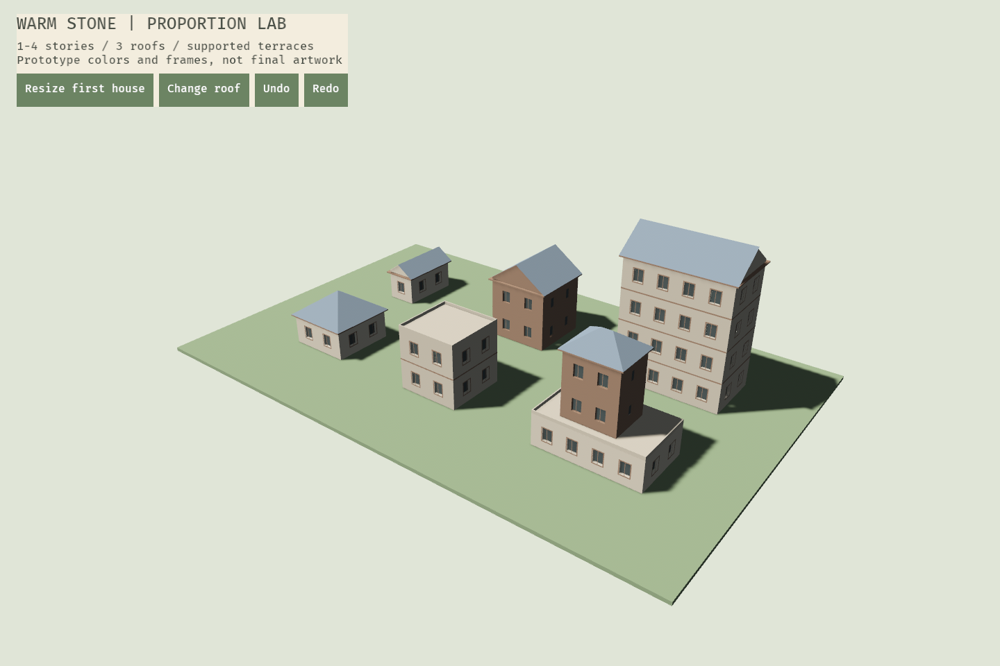

# 暖石庭院 · 美术资产制作与程序接入计划

> v0.1 · 2026-10-08 · 执行版
>
> 依据：[美术架构](../../TinyGlade_类手游_美术架构.md)、[建筑变化规则](../../TinyGlade_类手游_建筑变化与资产扩展设计.md)。本计划细化制作批次、文件合同与引擎验收，不扩大首版到室内、宠物或游戏手柄。

> 开发顺序修订：先做 Windows 桌面版。B0–B5 首轮引擎验收在桌面完成；下文 Android 性能、触摸与手机测量保留为后续移植门，不阻塞桌面首版。资产保持可降级，不因桌面优先改成无预算的高模。见[桌面执行计划](桌面版开发计划.md)。

## 1. 当前交付与尚未完成

已经有可生成墙面开孔、层间线、双坡/四坡/平顶及退台的纯 Mesh 编译器；暖石主题包含 5 个共享材质角色和几何参数。2026-10-09 已接入 Blender 原创基础窗、窗板窗、木门、烟囱，以及四套烘焙纹理，替换窗框和表面占位表达。六种建筑的主体仍程序化生成，保持可编辑；不是 Tiny Glade 级成品画质。

26 项清单现为 4 blockout / 22 planned。首批源为 `art-source/models/house-kit-v4.blend`，运行时资源为 `assets/themes/warm-stone/house-kit-v4/`；4 GLB、12 PNG 与同源 kit.json 已实际生成、检查并接入。门占用真实洞口，附件在后台按材质合并。制作细节和完整限制见[首批验收报告](房屋资产首批验收.md)。所有资产未作全量 production approved，UI 图标等仍待制作；没有把 AI 概念图当成模型或材质。



上图为早期对照：6 屋、23 批次、3,628 建筑三角形。接入首批后的当前图像与 50,420 三角形 / 26 批次统计见验收报告；两者均不是实测 GPU draw call、帧率或 Android 性能。

## 2. 制作策略：一套零件形成丰富建筑

不要以“先做几十栋完整小屋”为资产策略。房屋整体由尺寸与关系变化生成；美术定义轮廓、表面、边沿和可组合构件。

| 类别 | 具体内容 | 制作方式 | 为什么这样分 |
|---|---|---|---|
| 程序化主体 | 墙体、矩形洞口、楼层、三种屋顶、平台、道路 | 程序依据 GeometryProfile 生成 Mesh | 宽高与层数变化不受固定模型限制 |
| 固定端 + 重复中段 | 窗框、门框、屋檐、线脚、梁、墙帽 | 美术做端部/角和标准中段；程序定位/重复 | 角、框厚不随整栋房子拉伸 |
| 完整固定物件 | 烟囱、灯、桶、花盆、箱、凳 | 独立低模 GLB + 放置元信息 | 保留轮廓，可共享材质/实例化 |
| 表面 | 石、灰泥、木、瓦、草、土路 | 可平铺纹理或图集、受控法线与粗糙度 | 世界尺度稳定，不建每块砖/瓦 |
| 环境与 UI | 灯光、背景、草簇、22 图标、控件、字体 | 参数配置、矢量源、按需位图导出 | 产品可用性与场景风格统一 |

丰富度的来源是“宽度开间 × 楼层 × 支撑树 × 屋顶 × 立面族 × 门窗 × 装饰”，不是相同房子换几十张贴图。首个样片必须验证变化，之后才批准批量变体制作。

## 3. 美术与程序的文件合同

### 3.1 坐标、尺寸和锚点

- glTF / 引擎统一米制、Y 向上，墙面挂件正面为局部 +Z；地面物件默认前方 +Z。
- 墙面资产提供外框底部中心枢轴与 `opening-bottom` 锚点；地面物件提供底部中心枢轴，屋顶部件提供 `roof-contact` 锚点。
- Blender 的 Z-up 与导出后的 Y-up 要通过引擎验证，不凭编辑器视图猜测。
- 模型应用缩放；记录实际尺寸、包围盒、洞口占用、允许范围、固定端尺寸、重复轴与连接面。
- 建筑不是整体 GLB 的任意 scale。窗框中段能变长，固定角不能变形；烟囱、桶和灯只允许有限等比缩放。

旧 blockout 模板以 0.9×1.2m 洞口、0.09m 框宽开始，洞口下沿相对旧根为 `(0,0.09,0)`。**已接入 v4 使用独立新合同：根就是洞口底部中心 `(0,0,0)`，木框宽 0.11m**；脚本、编译件与装配器统一采用新合同，不混用旧锚点。外侧窗板需要额外横向空间；窄房采用基础窗。

### 3.2 目录与名称

```text
art-source/
  models/      可编辑 .blend：固定端/中段/物件
  textures/    分层图、烘焙源、平铺测试
  ui/          SVG 原稿、状态样片、字体许可
  motion/      往复修改和打断评审录像
  tools/       基础窗灰盒模板脚本（当前已有）
assets/
  themes/warm-stone/theme.json         当前已校验的比例与色板
  themes/warm-stone/modules/           后续模块 GLB
  themes/warm-stone/props/             后续固定物件 GLB
  themes/warm-stone/materials/         后续共享纹理
  manifests/models.json               26 项：4 blockout、22 planned
```

文件名小写 ASCII 连字符。资产稳定 ID 与文件路径分开；版本变化不随意改 ID。全部模型需记录作者、来源、许可、制作状态和预算；不能将 `pending` 许可或 `unassigned` 作者标为 approved。

### 3.3 材质与导出

初批采用 StandardMaterial、非金属、偏粗糙，先以纯色检查形体。材质角色 stone / plaster / timber / roof / window 已在主题配置中；当前 window 是不透明暗部，不做昂贵玻璃或室内。

正式纹理的基础色使用 sRGB；法线与参数图使用线性数据。ORM 为 R 遮蔽、G 粗糙度、B 金属度。纹理以真实米数重复，材质采样器需设置 Repeat；墙面切分后的 UV 相位也需连续。法线贴图接入前补齐切线生成并在引擎确认方向，不能仅交一张 PNG 就宣称接入完成。

Blender 使用能被 glTF 表达的材质节点，静态首版关闭动画、摄像机和灯光导出，GLB 尽量自包含。复杂 Blender 程序纹理要烘焙，不能假设导出后原样运行。依据 [Blender glTF 材质与导出说明](https://docs.blender.org/manual/en/3.4/addons/import_export/scene_gltf2.html) 和 [glTF 2.0 规范](https://registry.khronos.org/glTF/specs/2.0/glTF-2.0.pdf) 制定合同；项目实际 Blender 版本仍需以模板导出验证。

## 4. 制作批次与停止点

先做最小完整样片，再做批量扩展。以下是 1 名美术 + 程序配合的起始人日估算，不是自动承诺工期；完整 P0 仍沿用上层 70–105 美术人日，不重复叠加工时。

| 批次 | 顺序与交付 | 美术参考人日 | 通过条件 |
|---|---|---|---|
| B0 视觉基准 | 暖石色板、固定灯光、3/6/10m 与 1–4 层灰盒 | 3–5 | 远/中/近都能分辨轮廓，三屋顶与退台无穿插 |
| B1 第一座可变小屋 | 石/木/瓦首组材质、基础窗、石门框、檐边、1 组层间构件 | 7–10 | 在测试场拉宽/升高不失真、无纹理游走；优先于制作其余窗 |
| B2 建筑模块扩展 | 6 窗/3 门、8 层间模块、4 退台类、6 底座/连接类、3 立面族 | 14–21 | 最小/典型/最大尺寸、父子高度/退台组合全部过评审 |
| B3 屋顶与小物 | 2 烟囱、3 灯、12 小物及稳定布置规范 | 7–10 | 装饰不撞门窗/道路/上层，不因尺寸小改而重新随机排列 |
| B4 地面与工作台 | 草/路/少量草簇、22 图标、按钮面板状态、中文字体与控制点 | 10–15 | 手机可读/可触，状态明确；低档仍成立 |
| B5 整合与打磨 | 6 个作品、B01–B12、连续变化录像、Android 档位与预算修订 | 12–18 | 动画/存储/操作闭环及真机热稳定通过 |

这些批次约 53–79 人日，剩余上层预算留给方向反复、许可/文档、格式返工和完整回归。不要在 B1 未过时批准 B2/B3 全量制作。程序生成、工具和动画实现单独计入程序任务，不归入纯美术工时。

## 5. A01–A24 的可执行分工

| 组 | 具体交付物 | 批次 | 责任与当前状态 |
|---|---|---|---|
| A01 主题规范 | 色板、比例、3 镜头、固定灯光截图与配置 | B0 | 程序配置已有；美术批准未完成 |
| A02 石墙 | 平铺石纹、轻法线、帽/边收口 | B1 | 美术纹理；程序墙面与开孔已有 |
| A03 木材 | 顺纹理、端面、粗糙度与共享图集 | B1 | 美术；当前只有基础色 |
| A04 瓦材质 | 瓦纹与脊/檐接缝样例 | B1 | 美术；程序双坡形体已有 |
| A05 道路 | 土路平铺、草土过渡样片 | B4 | 联合；道路生成未实现 |
| A06 草地 | 草材质、少量草簇与降级规范 | B4 | 美术；测试场为纯色草台 |
| A07 门框 | 石、木、混合 3 款；固定端与中段合同 | B1/B2 | 美术建模；已列 planned |
| A08 窗 | 基础、百叶、窄竖、双联、格栅、横窗 | B1/B2 | 美术；模板脚本已有，模型未导出 |
| A09 灯 | 立灯、壁灯、窗灯；少量发光规范 | B3 | 美术；3 项 planned |
| A10 小物 | 圆盆、木盆、花箱、木箱/叠箱、桶、凳、柴、罐、花束、水盆、挂架 | B3 | 美术；12 项 planned |
| A11 环境 | 下午光照、背景、低/标准档样片 | B0/B4 | 联合；测试场灯光尚非美术冻结 |
| A12 图标 | 22 个统一 SVG 与状态导出 | B4 | 美术/UI；未制作，不加手柄提示 |
| A13 控件 | 按钮、卡片、滑条、面板、提示 | B4 | 美术/UI；当前已有中文工具栏与状态提示，仍为开发面板，非正式视觉资产 |
| A14 字体 | 中文正文/数字文件与许可记录 | B4 | 已接入 Noto Sans SC Regular，原文件、固定版本、SHA256 与 OFL 许可位于 assets/fonts；正式字阶与手机验收待完成 |
| A15 选择控制点 | 选中轮廓、尺寸/旋转/高度显示与热区 | B4 | 联合；包围框与线框预览已有；正式控制点/轮廓描边未完成 |
| A16 动效 | 主体/拓扑/细节样片，往复与打断录像 | B5 | 联合；SmoothValue 原语已有，画面动画未接入 |
| A17 立面规则 | 三族底/中/顶层、开间、样式替代规则表 | B1/B2 | 联合；基础窗格生成已有，手工优先未完成 |
| A18 层间构件 | 8 件：石细线脚/宽线脚/檐口/端盖、木横梁/立柱/角柱/交接件 | B2 | 美术模块；当前为程序化细横线 |
| A19 退台 | 顶面、边收口、角、低护沿 4 类 | B2 | 联合；程序平顶/护沿与退台差集已有 |
| A20 三屋顶 | 双坡/四坡/平顶比例与脊/檐/角收边 | B0/B2 | 联合；形体已有，瓦/脊细节未接入 |
| A21 立面族 | 石/抹灰/木三套搭配、色差规则与材质球 | B2 | 联合；基础色角色已有 |
| A22 烟囱 | 石烟囱、简单带帽烟囱 2 款 | B3 | 美术；2 项 planned，不含烟雾 |
| A23 基础转角 | 6 件底座直段/外角/端部、墙帽直段/折角/端帽 | B2 | 美术模块；未制作 |
| A24 变化样片 | B01–B12、6 作品、近远景及打断录像 | B0/B5 | 联合；当前 6 建筑比例场不是全部 B 用例通过 |

当前模型清单覆盖 6 窗 + 3 门 + 2 烟囱 + 3 灯 + 12 小物 = 26 项。A18/A19/A23 的至少 18 个结构模块在 B1 固定拼接协议后补入清单，避免先锁死尺寸。墙/屋顶等程序化主体不要求交一份完整房子 GLB。

## 6. 首周怎么开始

第 1–2 工作日：程序与美术一起评审比例测试场，冻结首版墙厚、窗框厚、檐伸、屋顶倾角、纹理重复米数。保留最窄/四层/退台样片，不只看默认 6m 房子。

第 3–4 工作日：用基础窗模板制作真正可复用的四角、直段和窗内，做石/木/瓦各一个材质样本。固定端与中段导出在引擎分别装配，验证 0.7/0.9/1.1m 窗宽和连续尺寸变化。

第 5 工作日：两人联合审查普通光照、侧光、近远景、无景深与低档。未通过则返修 B1，不批量复制剩余五种窗；通过后才开始 B2。

当前基础窗模板由程序生成灰盒起步；精修石/木边沿、纹理与比例仍需要美术编辑和批准。当前环境未发现 Blender，脚本只做语法检查，不能把 `.blend`/GLB 当作已经交付。

## 7. 资产进入工程的检查门

```text
planned → blockout → 引擎拼接/尺寸检查 → 正式建模与烘焙
        → 导出校验 → 变化/打断检查 → Android 测量 → approved
```

每项保留源文件、运行时文件、作者/许可、预算与评审截图。任何一步失败回退制作，不在错误比例上堆细节。

现有命令：

```powershell
cargo run -p garden-presentation --bin art-check --locked
cargo run -p garden-presentation --bin art-check --locked -- --strict
```

普通模式允许 planned，但不会读取不存在的文件，并明确输出批准数为 0。strict 要求全部记录 approved；本阶段预期不能通过生产门。检查包括：主题合法值、ID 唯一、模型路径不逃出 assets、作者/许可、静态 GLB 头/三角形/材质数量与预算、自包含文件约定。

当前检查器**不是完整 glTF 验证器**，不能证明轴向、UV、拓扑质量或所有二进制引用都正确。正式交付还要通过 [Khronos glTF Validator](https://github.com/KhronosGroup/glTF-Validator/blob/main/README.md)、引擎观察与真机测量；它提供格式与引用的一致性验证，不能代替美术评审。

## 8. 初始预算与联动验收

窗模块约 400–800 三角形、门框 500–700、烟囱 500–600、单小物 350–800，清单已有逐项上限。这是首轮预算，可按屏幕占比和整屋三角形测量修订，不承诺每个窗都独立 draw call。

常见整屋优先 2–4 材质分组；当前程序占位样例最多 5，混合立面/退台使用第五组是明确的临时差距，正式阶段通过共享图集和材质参数优化。小物复用材质；纹理基础色先 1024²、法线/ORM 512²，整体 GPU 驻留沿用 64–96MiB 目标，最终以真实分配和目标手机为准。

联合验收必须同时检查：3/6/10m 宽、1–4 层、三种屋顶、长短/近方形屋顶、父层升降、两个上层的合法退台、不断改目标与撤销、移动后 UV 不游走、手工覆盖与道路开门恢复。当前代码完成其中几何基础，未完成道路、覆盖和画面动画。

## 9. 程序接入顺序

1. 当前阶段：纯 Mesh + 固定主题基础色 + 比例观察窗口与截图 + 资产合同/检查器。
2. B1：纹理加载、Repeat 采样、切线、ArtCatalog 模型目录映射，基础窗分块装配；规范 Handle 生命周期。
3. B2：增加稳定 StyleId 和样式有效范围、布局替代；门窗框与层间构件合批/实例化，保持 PartKey。
4. 动效阶段：结构参数从 current 接目标、对应部件匹配；不同屋顶拓扑不做任意顶点硬插值。
5. 场景玩法阶段：道路开门、手工覆盖休眠、稳定小物布置与烟囱避障。
6. 手机阶段：固定评审场景逐档测帧时间/显存/发热；降级只减少细节，不改权威建筑数据。

避免误解：当前主题配置冻结在应用启动时；尚未实现运行中热切主题、六种真实窗样式加载或完整 glTF 模块装配。扩展这些能力不需要把 Bevy Handle 放回领域层。
