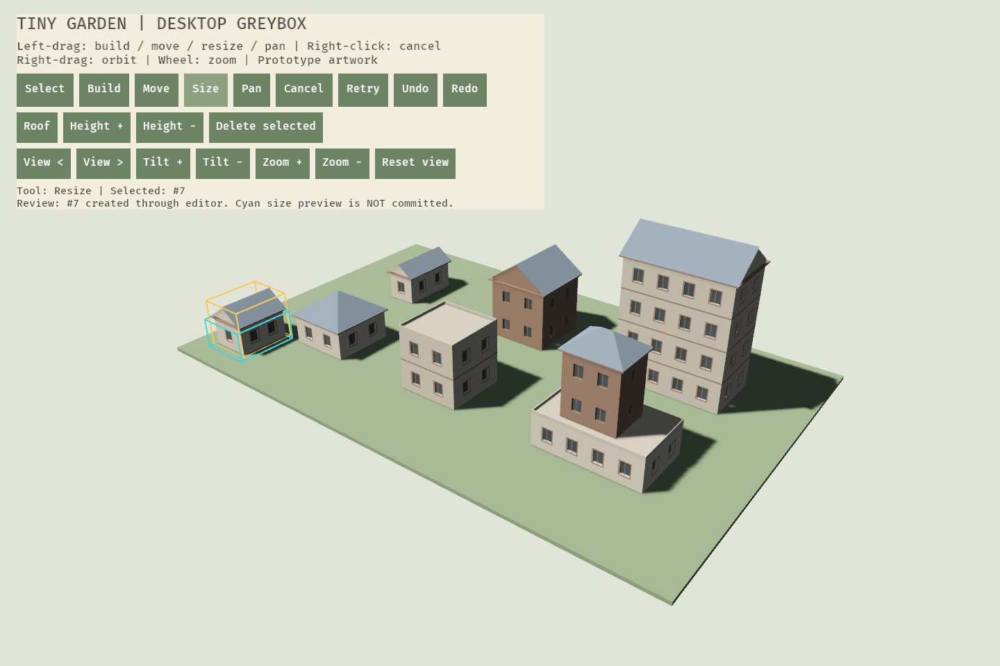
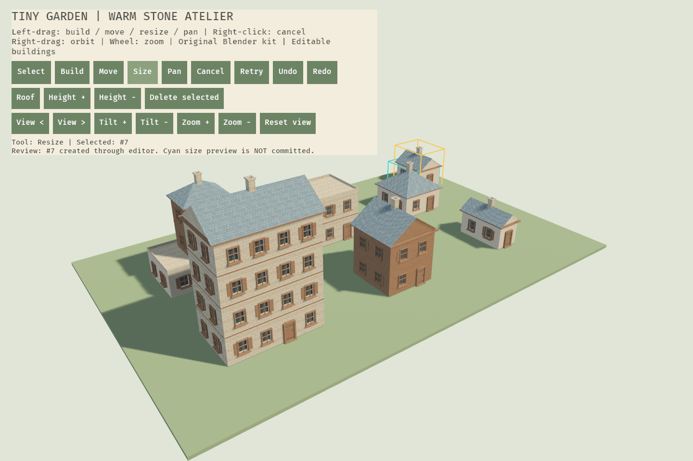
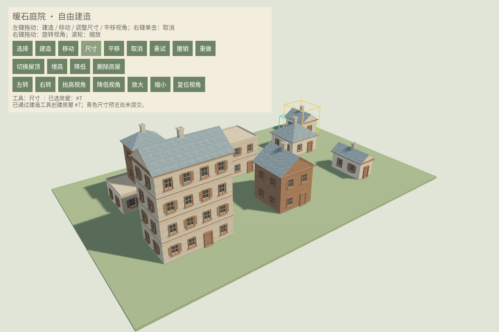

# 模块工程验证记录

## 2026-10-10 · 上下文自动重构系统

实施范围、数据合同、性能边界及操作说明见[上下文系统实现与验收](上下文系统实现与验收.md)。保留六 crate 依赖方向，统一语义解析、上传和显示交接入口；代码注释采用模块、接口及关键实现三层中文说明。

| 检查 | 实际结果 |
|---|---|
| `cargo test --workspace --all-targets --features garden-presentation/desktop --locked -j 1` | **149 项通过**：application 29、adapter 14、domain 8、generation 17 + 集成 9、geometry 3、presentation 69；所有二进制与示例目标编译通过 |
| `cargo test --workspace --all-targets --locked` | **默认功能 95 项通过**，不要求 GPU |
| Clippy，全 workspace、all targets、desktop，`-D warnings` | 通过，无警告 |
| `cargo fmt --all -- --check`、依赖边界、`git diff --check` | 通过 |
| `context_benchmark`，Windows / i7-9700 / Release | 32 笔、4096 点、4064 边、6 栋建筑：冷解析 137.337 ms，50 次缓存命中平均 5.292 ms，单窗修改 3.496 ms；单窗只重算一处立面，路网与全部地基命中 |
| `--context-review`，Intel UHD 630 / Vulkan | 实际创建、休眠、恢复、撤销及一致显示完成，截图成功；6 栋建筑、165 建筑分块、50,244 建筑三角形，待上传及遗留交接均为 0；地形及线性结构不计入建筑统计 |

回归覆盖自动类型与迟滞、端点/T 字口/交叉/重叠和高程分离拾取、稳定区间来源、连窗/自动门优先级与休眠恢复、精确地基地形采样、预览取消与单次历史、过期事务与空桶失效、共享池槽位、场景替换和资源回收。初始化回归修复了修订号 0 被误认为已生成空场景的问题。

验收图片：[上下文场景](../art-source/reference/context-system-20261010.png)、[中文工具栏](../art-source/reference/context-toolbar-20261010.png)。自动指针和真实 GPU 验证已通过；真实 OS 鼠标/失焦、全部 DPI 及触屏尚未验收。当前不包含导航、物理行走、存档或移动端适配。仅本地修改，未提交或推送。

## 2026-10-10 · 上传基础与结构规则重构

接口、设计意图、类型边界及 CPU 测量见[上传与结构规则重构](上传与结构规则重构.md)。本轮没有新增 crate 或改动依赖方向。

| 检查 | 实际结果 |
|---|---|
| `cargo test --workspace --all-targets --features desktop --locked` | 119 项通过：application 25、adapter 12、domain 7、generation 14、geometry 2、presentation 59；示例和二进制测试目标编译通过 |
| `cargo test --workspace --all-targets --locked` | 默认功能 73 项通过，不需要 GPU |
| `cargo clippy --workspace --all-targets --features desktop --locked -- -D warnings` | 通过，无警告 |
| `cargo fmt --all -- --check` | 通过 |
| `scripts/check-boundaries.ps1` | 通过：六 crate 依赖方向、四纯核心无引擎依赖、无手柄依赖 |
| `git diff --check` | 通过，无补丁空白错误 |
| `structure_benchmark` release，3 体块、100,000 次 | 完整解析 1043.0 ns/次，缓存命中 26.3 ns/次，持续失效 1285.8 ns/次 |

新增回归覆盖跨类型极小预算仍能完成安装、取消暂存保留复用网格、渲染就绪确认、结构缓存失效、位姿变化复用局部结构及预览参数一致。本次自动检查不代表新的真实窗口、GPU 帧率或端到端延迟验收。

以下内容保留各阶段的历史验证快照。

> 日期：2026-10-08 · 目录：D:\game\tiny-garden

## 环境

- Windows / x86_64-pc-windows-msvc。
- CPU：Intel Core i7-9700 @ 3.00GHz，8 核 / 8 逻辑处理器。
- rustc 1.97.1；cargo 1.97.1；工程最低 Rust 1.95。
- Bevy app / ECS / tasks 固定 0.19.1；其余精确解析版本在 Cargo.lock。

## 第一阶段：历史验证快照

下列 24 项测试和未实现项记录第一阶段状态；当前状态见文末第二阶段。

### 已实际执行

| 验证 | 结果 | 覆盖边界 |
|---|---|---|
| `cargo test --workspace --all-targets --locked` | 24 个测试全部通过，示例编译通过 | 8 application + 6 Bevy/transition + 5 domain + 3 generation + 2 geometry |
| `cargo clippy --workspace --all-targets --locked -- -D warnings` | 通过，无警告 | 全部库、测试、示例 |
| `cargo fmt --all --check` | 通过 | Rust 代码格式 |
| `scripts/check-boundaries.ps1` | 通过 | 5 crate 依赖方向，4 纯核心的传递依赖无 Bevy，全工程无 gilrs |
| `cargo check --workspace --target aarch64-linux-android --locked` | 通过 | Android ARM64 Rust 编译检查，不含链接、APK 或设备运行 |
| `cargo run -p garden-bevy --example headless --locked` | 通过 | 真实 Bevy Update 与异步布局任务，不使用 GPU |
| `cargo run -p garden-generation --example layout_benchmark --release --locked` | 通过 | CPU 布局微基准，不是渲染或移动端性能 |

测试重点：非法建筑拒绝且不改变原对象；支撑子树删除；Auto 层数迟滞及最小层高；堆叠实际屋顶与原意图分离；退台区域无重叠且面积正确；多次预览一步提交；取消不入历史；失败/无变化不入历史；undo 递增版本；删除身份不复用；其他对象 Arc 保持共享；待生成请求合并及公平顺序；外部 invalidation 使旧任务过期；切换会话重建投影；队列满明确返回错误；动画重定向保持当前值、不同时间步收敛一致。

## 无窗口演示输出

```text
step 1: width=3m, stories=1, front_windows=1, roof=Gabled, revision=1
step 2: width=6m, stories=2, front_windows=4, roof=Gabled, revision=2
step 3: width=10m, stories=4, front_windows=16, roof=Gabled, revision=3
step 4: width=6m, stories=2, front_windows=4, roof=Gabled, revision=4
pipeline: PipelineStats { launched: 4, applied: 4, discarded: 0, in_flight: 0 }
```

`front_windows` 是所有楼层正立面窗总数；每层开间依次为 1、2、4，撤销后恢复为 2。第四步 revision=4，而不是回退为 2。

## 布局微基准

Release / thin LTO；各工作负载预热 1,000 次，测 100,000 次；输入与输出经 black_box，包含布局向量分配/释放。

| 工作负载 | 本次平均耗时 |
|---|---|
| 10m 底层 + 两个上层，3 体块，支撑链 4 层，40 窗 | 3.075 μs / 建筑 |
| 100×100m 单体块，4 层，752 窗 | 12.193 μs / 建筑 |

这是一次本机测量的平均值，不是稳定帧率、p95 延迟或跨机器保证。第二个样本是大尺寸有效建筑，不代表所有合法组合的最坏情况。尚未包含墙体开孔、三角化、Mesh 上传、材质、阴影、透明过渡与触摸交互成本。

## 第一阶段当时未验证/未实现

- 没有游戏渲染窗口、GLB/原创美术资产接入或墙/屋顶 Mesh。
- 没有鼠标/触摸工具 UI、真实画面动画或拾取代理。
- 没有道路自动门、手工覆盖休眠与跨对象空间索引。
- 没有持久化 DTO、命令重放、原子写入、备份和平台生命周期集成。
- Android 只做了 cargo check，没有 NDK 链接、APK 打包或手机帧率/内存/发热验证。
- 当前测试证明已实现的核心规则与数据流，不代表完整 P0 或上层里程碑通过。

下一步见 [模块架构 A2–A6](模块架构.md)。

## 第二阶段：Mesh、比例场与美术制作合同

同日后续验证，包含可选 desktop 呈现模块。纯核心仍有 4 个，工程共 6 个 crate。

| 验证 | 实际结果 | 覆盖与限制 |
|---|---|---|
| `cargo test --workspace --all-targets --all-features --locked` | 37 项全部通过 | application 8 + Bevy 7 + domain 5 + generation 9 + geometry 2 + presentation 6；桌面二进制编译 |
| `cargo clippy --workspace --all-targets --all-features --locked -- -D warnings` | 通过 | 包含可选桌面渲染与资产检查器 |
| `cargo fmt --all --check` | 通过 | Rust 格式 |
| `scripts/check-boundaries.ps1` | 通过 | all-features 实际依赖图；6 crate 单向、4 核心无 Bevy、没有 gilrs |
| `cargo check --workspace --target aarch64-linux-android --locked` | 通过 | 默认无 desktop；不是手机渲染、NDK 链接、APK 或真机验证 |
| `art-check` | planned=26、blockout=0、approved=0 | 主题/模型清单元数据有效，尚无模型交付 |
| `art-check --strict` | 预期拒绝：window-basic is Planned | 生产门没有误把计划资产批准 |
| Blender 模板 AST 语法检查 | 通过 | PATH 未发现 Blender；未执行建模/导出 |
| 离屏 GPU 截图及人工图像检查 | 通过 | 6 建筑、三屋顶、1–4 层、退台、地面/阴影与 UI 可见 |
| 修改文档相对链接检查 | 通过 | 工程 README、艺术源说明、模块/制作计划及上层三文档 |

新增测试覆盖：墙洞带状差集及重叠开口；各种屋顶/尺寸的有限顶点、单位法线和三角形绕序；材料批次上限；米制 UV 与相邻切块 UV 相位；不支持的几何输入报告错误且不安装坏投影；替换与删除后旧孩子/旧 Mesh 释放；主题非法参数、模型 ID/来源信息、安全路径和基础 GLB 头/数量检查。

### 实机图像

[比例场截图 v3](../art-source/reference/proportion-lab-v3.png) 为本机实际 Bevy GPU 渲染，不是概念图。建筑统计：6 对象、23 材质批次、3,628 三角形；地面另计。批次统计不是 GPU draw call 实测。

调试过程保留：v1 在图形管线预热不足时截到纯背景；v2 延长预热后有建筑但无 UI；v3 为离屏摄像机显式设置默认 UI 目标后，建筑与 UI 同时可见。尚未执行桌面鼠标点击、真实触屏操作或所有 B01–B12 的视觉验收；按钮逻辑存在，不以静态截图代替交互验收。

### 更新后的 CPU 微基准

Release / thin LTO，本机单次采样。布局预热 1,000 次、测 100,000 次；Mesh 预热 100 次、测 10,000 次。Mesh 输入使用预先编译好的布局，包含缓冲分配、三角形校验及释放，不包含布局生成、GPU 上传、材质、阴影或交互。

| 工作负载 | 布局平均 | Mesh 平均 | Mesh 规模 |
|---|---|---|---|
| 10m 底层 + 两个上层，3 体块、40 窗 | 2.476 μs | 92.704 μs | 1,320 三角形 / 5 批次 |
| 100×100m 单体块，4 层、752 窗 | 8.172 μs | 1,424.240 μs | 18,238 三角形 / 4 批次 |

这是 CPU 子模块的平均耗时，不是 p95、全游戏帧时间或手机性能承诺；大建筑样本也不是所有合法组合的最坏情况。

### 当前未完成

- 正式 GLB 装配、可平铺贴图/法线/切线、六种窗/三门与完整结构模块。
- 自由建造鼠标/触摸手势、镜头交互、正式工具 UI 与中文字体。
- SmoothValue 接入可见结构、稳定构件拓扑过渡与动画中拾取。
- 道路开门、覆盖休眠、跨对象关系与装饰实例化。
- 持久化、平台生命周期、APK 打包、真机性能/内存/发热。

下一步为[美术制作计划 B0/B1](美术资产制作计划.md)：冻结比例并制作第一座可变小屋，而不是直接批准全部 planned 资产。

## 桌面优先修订：鼠标镜头第一步

用户指定先开发桌面版后，当前执行基线调整为[Windows 桌面 D0–D6](桌面版开发计划.md)。本轮只接入镜头，不把整个 D1 或自由建造标为完成。

| 验证 | 结果 | 覆盖 |
|---|---|---|
| `cargo test --workspace --all-targets --all-features --locked` | 42 项通过 | 原 37 项 + 5 个镜头测试；桌面二进制编译通过 |
| `cargo clippy --workspace --all-targets --all-features --locked -- -D warnings` | 通过 | 包含新增镜头与按钮系统 |
| `cargo fmt --all --check` | 通过 | Rust 格式 |
| `scripts/check-boundaries.ps1` | 通过 | 6 crate / 4 纯核心，无手柄依赖 |
| 修改文档相对链接 | 通过 | README、桌面/模块/美术计划与上层四文档 |
| 离屏 GPU 截图与图像检查 | 通过 | 建筑、原编辑按钮和新增 7 个镜头按钮可见，未发现 UI 裁切 |

镜头测试覆盖：初始姿态匹配原画面、非法位置拒绝；近远距离与俯仰限制；非法输入忽略；UI 起始拖动/滚轮不穿透；场景拖动跨 UI 保持所有权；不可用窗口取消并禁止旧拖动复活；真实 Bevy Update 中按钮缩放与复位。

这些输入测试使用合成状态，不代表已用操作系统鼠标、真实失焦事件或窗口外松开完成验收。当前尚无相机平移、建筑拾取、拖拽建造/编辑、连续可见动画或玩家存档；它们按 D1–D5 继续推进。

[桌面镜头截图](../art-source/reference/desktop-camera-v1.png)：初始摄像机位置仍为 `(40,38,52)`，6 建筑/23 材质批次/3,628 建筑三角形保持不变。当前画面仍是程序化占位美术。

## 2026-10-09 本地继续：编辑灰盒、尺寸与镜头平移

本轮只修改本地，没有提交或推送。开始时重新执行全工程检查，确认上次直接提交的选择/建造/移动实现通过 57 项测试；之后增加尺寸与平移。以下覆盖不代表 D1/D2 全部完成。

| 验证 | 实际结果 | 覆盖与限制 |
|---|---|---|
| `cargo test --workspace --all-targets --all-features --locked` | 62 项通过 | application 17 + Bevy 7 + domain 5 + generation 9 + geometry 2 + presentation 22 |
| `cargo clippy --workspace --all-targets --all-features --locked -- -D warnings` | 通过 | 新尺寸、平移、review capture 与队列保留修订 |
| `cargo test -p garden-presentation --features desktop --lib --locked` | 22 项通过 | 最终队列保留修订重新验证；新提交不能覆盖待重试命令，失败提示不会隐藏 Retry |
| `cargo fmt --all --check`、`git diff --check` | 通过 | 格式与空白检查 |
| `scripts/check-boundaries.ps1` | 通过 | 6 crate / 4 纯核心，无手柄依赖 |
| 修改文档相对链接 | 通过 | 工程及上层产品/实现计划链接 |
| `showcase --review-capture` + 图像检查 | 通过 | 第七屋实际生成；工具栏、黄色选中框与青色尺寸候选框可见，无 UI 裁切 |

新增核心测试：旋转房屋的尺寸调整按局部轴计算；多次拖动只提交一步；非法最后尺寸和取消不提交上一次有效候选；缩小父体块不能让上层失去承托。新增镜头测试：地面平移保持抓取点在鼠标下、保持相机高度、取消释放锚点、复位恢复原视图；非 Pan 模式不平移。

此前桌面集成测试现在已实际通过：相机投影/射线 → 建造 → 真实异步 Mesh/上传 → 精确三角形拾取 → 移动 → UI 撤销；取消指针预览不改变历史；队列满保留提交供可见 Retry。最终的队列保留修订另复测 presentation 单库，22 项通过。

示例六屋改用 ReplaceScene 载入，不占玩家历史。`--review-capture` 经 ToolController/CommandInbox 创建第七屋后断言撤销记录为 1，再产生尚未提交的 Size 预览。它是程序化评审场景，不是操作系统鼠标回放。



图像统计：7 建筑、27 建筑材质批次、3,842 建筑三角形，地面另计；相机仍为 `(40,38,52)`。统计不是 GPU draw call、帧率或移动性能测量。

仍未完成：真实鼠标/失焦/窗口外释放/DPI 验收；旋转与高度拖拽控制点、上层体块编辑 UI；连续可见动画、正式美术/中文 UI、道路与跨对象融合、作品持久化。当前跨建筑允许重叠，不把堆叠关系之外的相交自动融合；关闭应用不能保留新作品。

## 2026-10-09 Blender 首批资产接入

实际执行已安装的 Blender 5.2.2 LTS，当前有效版本 `house-kit-v4`。生成基础窗、窗板窗、木门、石烟囱和石/灰泥/木板/屋瓦四套 BC/N/ORM；保留 `.blend` 源、制作脚本与独立的手改源重导出工具。不是安装说明或 AI 概念图交付。仅本地修改，未提交/推送。

| 验证 | 实际结果 |
|---|---|
| Blender 建模/烘焙/导出 | 4 GLB / 12 PNG / kit.json；模板 1,468 三角形，单件预算通过 |
| 原 `.blend` 回读静态检查 | 尺度、变换、闭合组件、面数/材质通过 |
| 手改源重导出路径 | `exportprobe` 完整导出与格式/同源验证通过；仅为忽略的本地测试件，不替换有效 v4 |
| Khronos Validator 2.0.0-dev.3.10 | 四个 GLB 0 errors / 0 warnings；未用纯色材质的 UV/切线仅 info，报告保留 |
| GLB ↔ kit.json | 位置、UV、多重顶点计数一致；报告含 SHA256 |
| `cargo test --workspace --all-targets --all-features --locked` | **66 项通过**：application 17 + adapter 7 + domain 5 + generation 9 + geometry 2 + presentation 26 |
| `cargo clippy --workspace --all-targets --all-features --locked -- -D warnings` | 通过 |
| `cargo fmt --all --check`、`git diff --check` | 通过 |
| `scripts/check-boundaries.ps1` | 通过，六 crate / 四纯核心，无手柄依赖 |
| `art-check` | 22 planned / 4 blockout / 0 approved，模板 1,468 三角形 |
| `art-check --strict` | **按预期拒绝** blockout，未伪造生产批准状态 |
| GPU 全景/近景 | 6 建筑 / 26 批次 / 50,420 建筑三角形；窗门接触墙面，烟囱接触坡面，纹理实际载入 |
| GPU `--review-capture` | 新建第七屋使用同一 kit，显示未提交尺寸预览；7 建筑 / 31 批次 / 53,306 建筑三角形 |

新测试覆盖坏 kit、窄房/多层/三屋顶适配、固定框映射及退台上层；既有真实 async 上传/删除释放、相机射线建造→拾取→移动→撤销用例改为本批 kit。艺术编译在受票据保护的后台任务运行，纹理句柄仍只在表现层；显示和拾取共用含附件的最终 CPU 网格。

源生成有两类工具提示：Blender 5.2 的 `use_nodes` 弃用警告（6.0 前需更新脚本）；GLB exporter 多图 sampler 提示（本批各图均明确 REPEAT，Khronos 检查通过）。这不同于 glTF Validator 的 error/warning，不隐去工具日志。v1–v3 是未发布的制作迭代，保留本地并忽略，不污染有效资源清单。



评审完整图像、面数与保留意见见[首批验收](房屋资产首批验收.md)。暂未完成远景 LOD 选择、中心重复段、异形窗/精细檐脊、柔阴影与环境全量美术；仍未实现画面连续变形或作品保存。截图不是系统鼠标回放、帧率报告或移动端验收。

## 2026-10-09 IDE 游戏入口整理

游戏的 `src/bin/showcase.rs` 迁移为 `src/app.rs` 的 `app::run()`，增加四行的 `src/main.rs` 唯一游戏入口；原文件内容保留在 app 模块，不丢失美术或编辑功能。游戏目标改名 `tiny-garden` 并设置 `default-run`，`art-check` 保留独立工具入口。`desktop` 仍为显式 feature，不把 GPU 依赖默认引入纯核心测试。

新增共享 Cargo 配置 `.run/Run Tiny Garden.run.xml`，包含 desktop、正确工作目录及游戏目标；XML 语法和 Cargo 元数据检查通过。JetBrains 默认会自动为指定目标加入 required-features，故可以点击 main 左侧运行按钮；配置已写入项目文件，但未进行操作系统 IDE 点按钮回放，不声称已实测 GUI 点击。

重新执行全工程 all-targets / all-features 测试，仍为 66 项通过；Clippy `-D warnings`、Rustfmt 和六 crate 边界检查通过。工程与桌面运行文档已改为新的游戏目标；此前 showcase 验证记录保留为历史记录。

最后用 `cargo run -p garden-presentation --features desktop --locked -- --capture art-source/reference/main-entry-v1.png` 验证默认目标（不传 --bin）：实际运行 `tiny-garden.exe`，退出码 0，6 建筑 / 26 批次 / 50,420 建筑三角形。该检查证明新入口能启动并渲染，不是手工点击 IDE 的回放。

## 2026-10-09 桌面 UI 中文化

窗口标题、20 个工具/镜头按钮、操作说明、选中状态、提交/撤销/队列提示、建造规则和失败提示改为中文。新增表现层 `ui` 模块，集中工具名称、错误文案、工具栏和字体配置；核心领域错误、命令枚举与日志诊断保持原结构，不修改领域层依赖方向，也未引入多语言框架。

随游戏资产加入未修改的 Noto Sans SC Regular，固定上游版本、8,331,336 字节、SHA256、OFL 许可见 `assets/fonts/README.md`。所有 23 个文本实体显式使用同一个字体资源；正常启动无需系统字体或运行时网络。离屏截图会等待字体和纹理加载完成。

| 验证 | 实际结果 |
|---|---|
| `cargo test --workspace --all-targets --all-features --locked` | **69 项通过**，其中 presentation 29；新增字体绑定/中文标签、工具/错误文案和真实 UI→撤销拒绝→中文状态链路测试 |
| `cargo clippy --workspace --all-targets --all-features --locked -- -D warnings` | 通过 |
| `cargo fmt --all --check`、六 crate 边界检查、`git diff --check` | 通过；Git 的 LF→CRLF 提示不属于检查失败 |
| `cargo run -p garden-presentation --features desktop --locked -- --review-capture art-source/reference/desktop-ui-zh-v1.png` | 退出码 0，实际生成 1440×960 GPU 截图；7 建筑 / 31 批次 / 53,306 建筑三角形，32/32 网格可见 |
| 截图目视检查 | 中文标题、20 个按钮、说明和「工具：尺寸 / 已选房屋：#7」正常，没有方框或面板文字溢出；保留未提交的青色尺寸预览 |



已知依赖提示：当前锁定的 Parley 0.9.0 使用 `WordSegmenter::new_for_non_complex_scripts`，ICU4X 在分析中文文本时输出 `No segmentation model for complex script: Chinese/Japanese`。这是文本依赖的中文按词分割能力提示，不是字体缺字或此次截图失败；本次未升级/替换引擎依赖，后续中文按词选择/分词体验需单独评估。截图不证明小窗口、全 DPI 或触摸适配；正式 UI 图标与面板美术仍待制作。本次仅本地修改，未提交或推送。

## 2026-10-09 建造延迟与迭代速度优化

用户报告"建造时画面要等很久才更新"。实测为两个独立问题，都已修复；只改任务池归属与 Cargo profile，不改领域规则、JobTicket 语义、队列/背压上限、投影结构或美术合同。

### 根因一：生成任务与渲染器共用 Bevy 的 AsyncComputeTaskPool

`GardenPlugin::dispatch` 原来把布局/网格任务 spawn 到 `AsyncComputeTaskPool`。Bevy 渲染器在同一个池上异步创建着色器管线（`bevy_render/src/render_resource/pipeline_cache.rs` 的 `create_pipeline_task`），而该池只分到 25% 逻辑核心：本机 8 逻辑处理器下只有 2 个线程。启动后的管线编译窗口内，一次建造请求只是排队。

`--review-capture` 插桩实测（修复前）：第 7 栋 `t=1.954s` 派发，任务体直到 `t=5.917s` 才开始（排队 3.96s），自身计算 7ms，`t=5.974s` 被收集，`t=6.231s` 画面上出现。同期帧间隔稳定在 20–25ms，说明画面没有卡死，只是任务没被调度——这正是"点了建造要等好几秒"的形态。

修复：`GardenPlugin` 持有自己的 `TaskPool`（`Settings::generation_threads`，默认 2，0 视为非法配置），生成任务不再进入渲染器的池。修复后同一场景：`t=0.633s` 派发、`t=0.633s` 开始（排队 0ms）、`t=0.634s` 完成、`t=0.698s` 出现，即约 3 帧。

### 根因二：dev profile 完全没有优化依赖

Bevy 的着色器处理、渲染准备与管线创建在 opt-level 0 下慢约一个数量级。现在 `[profile.dev.package."*"]` 使用 `opt-level = 3`、`debug = false`；工作区 crate 保持 0（实测 opt-level 1 每次编辑多花约 6s，而帧时间无可测差异）。

| 测量（本机 dev / Intel UHD 630） | 修复前 | 修复后 |
|---|---|---|
| 单文件增量构建（presentation） | 20.90s（编译 1.74s + 链接 18.48s） | 6.16s（编译 1.57s + 链接 3.42s） |
| 首个可截帧时间 | 2.44s | 0.45s |
| 900 帧离屏循环 | 29.75s | 18.53s |
| 建造请求 → 画面上出现 | 4.28s（其中排队 3.96s） | 0.07s |

以上是 `--capture` / `--review-capture` 插桩数据，插桩已全部移除；不是 release 承诺、移动端帧率或 GPU draw call 测量。首次改 profile 需要重建依赖，本机一次性耗时 12m22s。

### 验证

| 验证 | 实际结果 |
|---|---|
| `cargo test --workspace --all-targets --all-features --locked` | **71 项通过**：application 17 + adapter 9 + domain 5 + generation 9 + geometry 2 + presentation 29 |
| `cargo test -p garden-presentation --features desktop --locked` | 29 项通过 |
| `cargo clippy --workspace --all-targets --all-features --locked -- -D warnings` | 通过 |
| `cargo fmt --all --check` | 通过 |
| `scripts/check-boundaries.ps1` | 通过，6 crate / 4 纯核心，无手柄依赖 |
| `cargo run -p garden-bevy --example headless --locked` | launched 4 / applied 4 / discarded 0 / failed 0 |
| GPU `--capture` / `--review-capture` | 退出码 0；6 建筑 / 26 批次 / 50,420 三角形；review 7 建筑 / 31 批次 / 53,306 三角形 |
| 新增测试 | `generation_threads = 0` 被拒绝；插件自有池线程数等于配置值 |

本轮未改：`results_per_frame`、每帧两建筑上传上限、`to_bevy_mesh` 的主线程切线生成（单帧内成本，留作后续项）、`[profile.release]` 的 LTO 取舍。仍未做：`bevy/dynamic_linking` 迭代开关、真实鼠标回放、Android 真机验证。本次仅本地修改，未提交或推送。

## 2026-10-09 · 后续轮次：优化方案 1–4 已实现

上述 71 测试与整栋上传记录保留为历史，当前状态以[优化实现与验收](优化实现与验收.md)为准：87 测试通过，主线程切线已移到后台，部件缓存与 GPU Handle 复用已接通，每帧默认 512 KiB/8 批次，一致性组准备/过渡及最新目标优先均有回归。Clippy、格式、边界与 git diff 空白检查通过。

同配置 CPU 基准，增高中位数 69.006 → 16.226ms，移动零新顶点/上传；不是端到端屏幕响应承诺。两次 GPU 建造/增高/过渡/预览截图退出码均为 0，当前七屋实际 197 材质分块、55,658 三角形、0 待上传/遗留过渡。批次增加的代价与尚未做的 GPU/真实窗口/手机验收明确列于新记录；仅本地修改，未提交推送。

## 2026-10-09 · 回到原路线：M1 建筑工具

用户明确不需要万级场景，继续既有桌面 D2/D3。已接入实际网格的体块拾取、独立宽深/高度/整栋旋转控制点、上层新增/删除/子树移动、所选体块屋顶/立面，以及固定资源池的简化实体预览。完整语义、工程边界与遗留项见[M1 建筑工具推进](M1建筑工具推进.md)。

| 检查 | 实际结果 |
|---|---|
| `cargo test --workspace --all-targets --all-features --locked` | **103 项通过**：application 24 + adapter 11 + domain 6 + generation 9 + geometry 2 + presentation 51 |
| `cargo test --workspace --doc --all-features --locked` | 通过；六 crate 文档编译成功，当前没有可执行文档样例 |
| Clippy 全 workspace/all targets/all features，`-D warnings` | 通过 |
| `cargo fmt --all --check`、依赖边界、`git diff --check` | 通过；既有 LF→CRLF 提示不属于失败 |
| `--tools-review building-tools-v1.png` | 重跑退出 0；建造/上层/高度/旋转/控制点，7 建筑、198 分块、55,382 三角形、0 待上传/遗留过渡 |
| `--review-capture building-preview-v1.png` | 消除重复组件更新后重跑退出 0；7 建筑、197 分块、55,658 三角形，2 个简化预览实体可见 |
| 目视检查 | 中文按钮/状态、上层高亮、四彩色控制点和简化尺寸预览正常；当前 27 个按钮、30 个字体绑定文本 |

新增回归：高度绝对增量/无效末采样、中心旋转与角度展开、独立宽深与承托拒绝、支持子树移动/删除与撤销、ID 墓碑/溢出、1×/2×逻辑像素命中、显示姿态控制点、UI→上层→样式/删除/撤销、相机射线→控制点→单步提交、过期显示拒绝、固定预览资源/正式目标交接。稳定预览不反复标脏渲染组件也有自动断言。

工具 GPU 脚本首次遇到阶段间选择被反馈清理（NoSelection），已显式选择已创建对象后重跑通过。预览 GPU 检查首次在 Intel UHD 630 / 驱动 31.0.101.2141 遇到 DeviceLost/Out of memory；消除稳定预览重复组件更新后重跑通过。尚未独立证明设备丢失根因，保留后续驱动/窗口稳定性复测项，不以单次通过宣称根因已修复。

M1 工具代码和自动回归接入不等于完整发布验收：真实 OS 鼠标/窗口打断、全窗口尺寸/DPI、连续手感视频与 Windows 包待补；预览不是完整贴图模型，跨建筑重叠规则仍未实现。没有存档，关闭会丢失作品。仅本地修改，未提交/推送；不增加万级性能里程碑。
